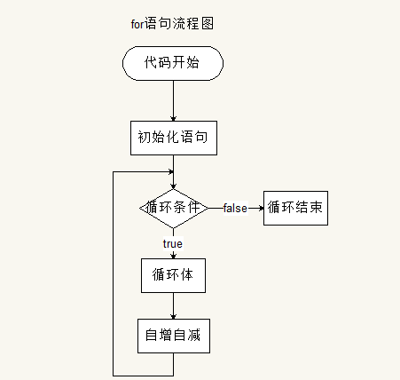

# JavaScript 基础

# 书写位置

- 第一种 : 写在`script`标签中

```html
<script>
  alert('Hello World!')
</script>
```

- 第二种 : 引入一个 js 文件

```html
<script src="main.js"></script>
```

**注意：**

1. script 可以放在很多地方，但是我们一般规范写在 body 的最后面；
2. 使用 src 引入的标签不能再在标签内写 js 代码 (写了不会执行)

!> 通过 `src` 请求到的 `js` 文件，会被解析到 `script` 标签内，并且覆盖原 `script` 标签内的 `js` 代码

!> script 标签的 src 属性可以写任何路径或文件，并不仅仅只能写 js 文件

# 注释

> 注释代码不会被执行，仅仅起到一个提示的作用。注释可以对复杂的代码进行解释，方便后期的维护和开发。

- 单行注释 :

  ```js
  // 这是单行注释， 单行注释只能写一行代码
  // 快捷键： ctrl + /
  ```

- 多行注释 :

  ```js
  /*
  	这是多行注释，在多行注释中可以
  	换行
  	快捷键  ctrl + shift + /
  	不可嵌套
  */
  ```

# 输出语句 (5 种)

- **alert : 警告框**

  ```js
  // alert会弹出一个警告框
  alert('hello world')
  ```

- **confirm : 确认框**

  ```js
  // confirm弹出一个确定框
  confirm('我帅吗？')
  ```

- **prompt : 输入框**

  ```js
  // prompt:弹出一个输入框，可以输入值
  prompt('请输入你的真是年龄')
  ```

- **document.write : 网页中写入内容**

  ```js
  // 可以识别标签
  document.write('hello world')
  document.write('<h1>hello world</h1>')
  document.write(Date()) // 输出当前时间
  ```

- **console.log：控制台输出**

  ```js
  // F12打开控制台，在console中可以看到打印的信息
  console.log('hello word')
  ```

# 变量

```js
// var 声明变量
var age
age = 12 // 先声明,后赋值
var age = 12 // 同时声明+赋值
var age, name, sex // 直接声明变量,可一次声明多个，用逗号隔开
height = 100 // 不声明变量，直接赋值(不会报错，但是不推荐)
console.log(height) // 不声明变量，也不赋值变量，直接使用（会报错）v

function add(num1, num2) {
  return num1 + num2 // 把两个数字加起来
}
/*
var student = {
	name:'小明'
}
*/
```

- 变量**命名要求**（变量是[标识符][1]的一种）

  1. 以字母、下划线或美元符号（\$）开头
  2. 由字母、下划线、美元符号（\$）和数字组成
  3. 标识符**区分大小写**
  4. 标识符不能使用关键字和保留字
  5. 如果重新声明 JavaScript 变量，该变量的值不会丢失 `var car='yellow'; var car` car 的值依然是 'yellow'

> 关键字 (有特殊意义的一些单词)
> `break` `do` `instanceof` `typeof` `case` `else` `new` `var` `in` `catch` `finally` `return` `void` `continue` `for` `switch` `while` `try` `debugger` `function` `this` `with` `default` `if` `throw` `delete`
>
> 保留字
> `abstract` `enum` `int` `short` `boolean` `export` `interface` `static` `extends` `long` `super` `Char` `final` `native` `Class` `synchronized` `package` `throws` `Const` `goto` `private` `transient` `degubber` `implements` `volatile` `double` `import` `public` `byte` `float` `protected`

交换两个变量的值

1. 使用临时变量 **(必须掌握)**

   ```js
   var temp = a
   a = b
   b = temp
   ```

2. 不使用临时变量

   ```js
   a = a + b
   b = a - b
   a = a - b
   ```

# 基本数据类型

## Number

- 浮点数

```js
var num = 3.1416 // 3.1416
var num = 3.12e2 // 312
var num = 3.12e-1 // 0.312
```

- 整数

```js
var num = 10 // 10
var num = 070 // 56 (八进制)
var num = 0xa // 10 (十六进制)
```

- 特殊值
  > `NaN` `Infinity`

```js
var num = 1 / 0 // Infinity (无穷大)
```

> 通过 `isNaN(num)` 可以判断是否是一个数字，返回 false 的时候，表示是一个数字

- 浮点数精度丢失问题

```js
// 在进行浮点数运算的时候，可能会出现精度丢失的问题
0.1 + 0.2 = 0.30000000000000004
0.2 + 0.2 = 0.4
// 尽量少用浮点数进行运算，不要让浮点数进行比较

// 解决办法 : 根据小数点后面的位数量 乘以对应的整数
0.1 + 0.2  ==> (0.1*10+0.2*10) / 10 = 0.3
```

## String

只要是在**单引号或双引号**内的就是 `String` 类型

```js
var name1 = 'hello'
var name2 = 'july'
var name3 = '3.1416'
// 使用索引位置来访问字符串中的每个字符,字符串的索引从 0 开始
var character = name1[3] // l
// 内置属性 length 来计算字符串的长度
console.log(name1.length) // 5
```

> 若在字符串中使用引号，字符串中的引号不要与字符串的引号相同，或在字符串添加转义字符 `\`

字符串可以是对象

```js
var x = 'john'
var y = new String('john')
typeof x // String
typeof y // Object
```

## Boolean

布尔型，只有 `true` 和 `false` 两个值，且是小写

true : `1`、`2`、`1.1`、`-1`、`'0'`、`'1'`、`[]`、`Infinity`、`-Infinity`、...

false : `0`、`''`、`null`、`NaN`、`undefined`

> 所有非 0 数都是 true，0 是 false

```js
var sex = true
if (sex) {
  document.write('男')
} else {
  document.write('女')
}
```

<span class="red">真值：</span> 在 JavaScript 中，**[Truthy](https://developer.mozilla.org/zh-CN/docs/Glossary/Truthy)**（真值）指的是在[布尔值](https://developer.mozilla.org/en-US/docs/Glossary/Boolean)上下文中，转换后的值为真的值。所有值都是真值，除非它们被定义为 [假值](https://developer.mozilla.org/en-US/docs/Glossary/Falsy)（即除 `false`、`0`、`""`、`null`、`undefined` 和 `NaN` 以外皆为真值）

## Array

```js
var car = new Array()
cat[0] = 'yellow'
cat[1] = 'red'
cat[2] = 'blue'
// 或
var cat = ['yellow', 'red', 'blue']
```

> 关键词 `new` 用于声明新变量的类型

## Object

由花括号分隔，属性和方法的容器；对象的属性以名称和值对的形式 (name : value) 来定义；多个属性由逗号分隔。对象的方法定义了一个函数，并作为对象的属性存储。对象方法通过添加 `()` 调用

```js
var cat = new Object()
cat.name = 'kitty'
cat.age = '2'
cat.eat = function() {}
// 或
var cat = {
  name: 'kitty',
  age: 2,
  eat: function() {}
}
```

对象属性有两种访问方式：

```js
name = cat.name
name = cat['name']
```

对象方法的访问：

```js
eat = cat.eat() // 输出函数执行结果
eat = cat.eat // 输出函数表达式
```

## Null

只有一个值：`null`，表示对象不存在

```js
var cat = null // 将cat的值清空
```

- str.match()方法匹配不到返回 null
- 通过 document.querySelector、getElementById() 获取不到元素返回 null

## Undefined

只有一个值：`undefined`

- 已声明未赋值的变量

```js
var a
console.log(a) // undefined
```

- 没有明确返回值的变量

```js
// 获取对象不存在的属性
var obj = { a: 1, b: 2 }
console.log(obj.c) // undefined

// 数组下标不存在
var arr = ['zs', 'ls', 'ww']
//           0    1     2      下标从零开始，长度为3
arr[5] // undefined

// 函数没有返回值
function getSum(a, b) {
  console.log(a + b)
}
// getSum(20, 30) // 50
var result = getSum(20, 30)
console.log(result) // undefined

// 函数参数没有传入
function f(i) {
  console.log(i)
}
f() // undefined
```

## typeof 操作符

> 是一个操作符而不是函数，圆括号可以使用，但不是必需的

```js
var num
typeof num // undefined
typeof num1 // undefined
// 对未初始化和未声明的变量执行 typeof 操作符都返回 undefined 值

var num = 1
typeof num // number

var num = '1'
typeof num // string

var flag = true
typeof flag // bollean

typeof true // boolean

typeof null // object ==> null 被认为是一个空的对象引用

var cat = { name: 'kitty' }
typeof cat // object
```

# 数据类型转换

## 转换成字符串

1. 调用 `toString()` 方法 （显式转换）

   ```js
   var a = 1
   var result = a.toString()
   console.log(typeof result) // string
   console.log(typeof a) // number
   ```

   null 、undefined 没有 toString() 方法

2. 调用 `String()` 构造函数（显式转换）

   ```js
   var str1 = String(a)
   console.log(typeof str1) // string
   ```

3. 直接和字符串做加法运算(推荐方法) （隐式因式转换）

   ```js
   // 任意数据类型的变量和字符串做加法运算结果都是字符串
   var str2 = a + ''
   console.log(typeof str2) // string

   var b = true
   console.log(typeof (b + '')) // string
   ```

## 转换成数值

1.  `Number(a)`

```js
var num1 = Number('123')
var num2 = Number('123c')
console.log(typeof num1) // number
console.log(typeof num2) // NaN
// 如果字符串不能转换成合法数字，转换结果为 NaN
```

2. 使用 `parseInt()`

```js
var num2 = parseInt('12.3')
console.log(typeof num2) // number
console.log(num2) // 12 只保留整数

var num3 = parseInt('15xyz')
var num4 = parseInt('15x6yz')
console.log(typeof num3) // number
console.log(num3) // 15
console.log(num4) // 15
// 如果字符串里有非法的数字，会逐个转换，直到遇到无法转化的字符串为止
```

3. 使用 `parseFloat()` 完成

```js
var num3 = parseFloat('12.34')
console.log(typeof num3) // number
console.log(num3) // 12.34 可以保留小数位
```

4. 让字符串和数字做除了加法以外的运算（隐式转换）

```js
var d = '345'
var num4 = +d // 前面加 + （正）号也可以转换
// num4 = d - 0
// numb4 = d * 1
// num4 = d / 1
console.log(typeof num4) // number
console.log(num4) // 345
```

### 补充

> `parseInt()` 函数解析一个字符串参数，指定该字符串为指定基数的进制值，并返回一个 10 进制的整数，如果被解析参数的第一个字符无法被转化成数值类型，则返回 `NaN`
>
> 参考 [parseInt](https://developer.mozilla.org/zh-CN/docs/Web/JavaScript/Reference/Global_Objects/parseInt)

```js
// 语法
parseInt(string, radix)
// string 要被解析的值，如果参数不是一个字符串，则将其转换为字符串
// radix 基数,表示进制，介于 2 和 36 之间的整数，参数 radix 的值为 0，或没有设置该参数时，parseInt() 会根据 string 来判断数字的基数
// 返回解析后的整数值。 如果被解析参数的第一个字符无法被转化成数值类型，则返回 NaN。
parseInt('123', 5) // 将 '123' 看作 5 进制数，返回十进制数 38
  [(1, 2, 3)].map(parseInt) // [1, NaN, NaN]
// [1, 2, 3].map(parseInt(item, index))
```

> `parseFloat()` 函数解析一个字符串参数并返回一个浮点数，如果给定值不能被转换成数值，则会返回 NaN。

```js
// 语法
parseFloat(value)
// value 需要被解析成为浮点数的值
parseFloat('3.14') // 3.14
```

## 转换成布尔值

1. 使用 `Boolean()` 完成

```js
var a = 45
var result1 = Boolean(a)
console.log(result1) // true
// 对于数字类型来说：一般的数字都转换成为true，0、NaN 会被转换成为false

var str = 'hello'
// var str = ''
// var str = ' '
var result2 = Boolean(str)
console.log(result2) // true
// 字符串中只有空的字符串会被转换成为 false

var result3 = Boolean(undefined)
console.log(result3) // false

var result4 = Boolean(null)
console.log(result4) // false

var b = false
var result5 = Boolean(b)
console.log(result5) // false
```

**0, NaN, 空字符串，undefined, null, false 会被转换成为 false**

2. 使用 `!!`

```js
console.log(typeof !!a) // boolean
console.log(!!a) // true
```

3. 自动转换

```js
if ('') {
  console.log('哈哈')
}
```

## 变量转换表

| Value     | Boolean  | Number   | String            |
| --------- | -------- | -------- | ----------------- |
| undefined | false    | NaN      | "undefined"       |
| null      | false    | **0**    | "null"            |
| true      | true     | 1        | "true"            |
| false     | false    | 0        | "false"           |
| ""        | false    | 0        | ""                |
| "123"     | true     | 123      | "123"             |
| "1a"      | true     | NaN      | "1a"              |
| 0         | false    | 0        | "0"               |
| 1         | true     | 1        | "1"               |
| Infinity  | true     | Infinity | "Infinity"        |
| NaN       | false    | NaN      | "NaN"             |
| {}        | **true** | NaN      | "[object Object]" |

# 操作符

## 算数操作符

> `+` 、`-` 、`*` 、`/` 、`%`

```js
var num = 5 + 6 // 11
var num = 5 % 2 // 1 取余数
var num = 5 % -2 // 1
var num = -5 % 2 // -1 只与左边值的符号有关

var num = '5' + 6 + 7 // "567" 数字与字符串相加，返回字符串
var num = 5 + 6 + '7' // "117"
var num = '' + 5 + 6 + '7' // "567" 字符串 + 数字得到字符串
var num = '' + 5 + 6 + 7 // "567"

var num = 5 + true // 6  返回数值，false 转成 0，true 转成 1

var num = '1' + true // "1true" 字符串与布尔值相加,布尔值转化成字符串
```

## 赋值操作符

> `a = a + 1` 即 `a++`, `a = a - 1` 即 `a--` > `a = a + 5` 可简写成 `a += 5`，类似的还有 `a -= 5`、`a *= 5`、`a /= 5`、`x %= y`
>
> 赋值运算符左边不能是常量或表达式

```js
var age = 10
var num = age++ // num = 10 age = 11 (先将变量中的值取出做赋值操作,再自身+1)

var age = 10
var num = ++age // num = 11 age = 11 (先自身+1,然后再将+1后的结果赋值)

var num = 5
console.log(num++) // 5
console.log(++num) // 7

var x = 3
var y = x++ + ++x + x * 10 // x = 3
// y = 3 + ++x + x * 10  // x = 4
// y = 3 + 5 + x * 10 // x = 5
// y = 58
```

## 关系操作符

> `>` 、`<` 、`>=` 、`<=`
>
> `==` 相等 、`！=` 不相等 、`===` 全等 、`！===` 不全等
>
> `in` `instanceof`

```js
var result = 6 > 4
alert(result) // true 输出Boolean类型
```

运算符的结果类型为 `Boolean`

- `>` 、`<` 、`>=` 、`<=` 、`==` 相等、`!=` 不相等 （字面量比较）

  在比较前先执行类型转换

  - 如果有一个操作数是**布尔值**，则在比较相等性前先将其转换为**数值**---false 转换为 0，true 转换为 1
  - 如果一个操作数是**字符串**，另一个操作数是**数值**，则在比较相等性前将字符串转换为**数值**
  - 如果两个值都是字符串，则按照字符串的字符编码进行逐位比较
  - 如果一个操作数是对象，另一个不是，则调用对象的 valueOf()方法，用得到的基本类型值按照前面的规则比较
  - 如果两个操作数都是对象，则比较它们是否指向同一个对象
  - **null 和 undefined 是相等的**
  - 在比较相等性之前，不能将 null 和 undefined 转换为其他任何值
  - 如果有一个操作符是 NaN，则相等操作符返回 false，不相等操作符返回 true；即使两个操作数都是 NaN，也一样

* `===` 全等、`！===` 不全等
  两个操作数在未经转换的情况下相等返回 true，不相等返回 false

```js
0 == false // true
1 == true // true
2 == true // false

false == "0" // true
'' == 0 // true
'4' == 4 // true

null == undefined // true
undefined == 0 // false
null == 0 // false

"NaN" == NaN // false
5 == NaN // false
NaN == NaN // false
NaN != NaN // true

[] != [] // true
[] == [] // false
[] == ![] // true
{} == {} // false
1 == [] // false
1 == [1] // true

-0 === 0 // true
"4" === 4 // false
undefined === null // false
```

- `in`

  判断对象是否能够访问到该属性

- `instanceof`

  判断一个对象是否是另一个对象的实例

## 逻辑操作符

> `！` 非、`&&` 与、`||` 或

- `!` 对 Boolean 值取反

```js
var flag = true
alert(!flag) // false

alert(!0) // true
alert(![]) // false
alert(!“”) // true
alert(!![]) // true
alert(!!1) // true
```

- `&&` 如果第一个值转换成 boolean 值之后为 true， 则输出第二个值；如果第一个值转换成 boolean 值之后为 false，则输出第一个值，且第二个值不在执行。（取第一个为 false 的值，如果都为 true ，则输出最后一个值。）

```js
var result = true && 3 // 3
var result = 1 && 3 // 3
var result = [] && '' // ""
var result = false && 3 // false
var result = '' && 3 // ""
var result = null && true // null

var num = 0
var result = '' && num++ // ""  num = 0
```

`&&` 使用場景

```js
function animate (fn) {
  fn && fn()
}
// 不传参数不会报错
animate()
```

- `||` 如果第一个值转换成 boolean 值之后为 true， 则输出第一个值，且第二个值不在执行；如果第一个值转换成 boolean 值之后为 false，则输出第二个值，以此类推，（取第一个为 true 的值，如果都为 false ，则输出最后一个值。）

```js
var result = true || 3 // true
var result = 1 || 3 // 1
var result = [] || '' // []
var result = false || 0 // 0
var result = '' || 3 // 3
var result = num || true // true

var num = 0
var result = 3 || num++ // 3  num=0
```

`||` 使用场景

```js
// 1.兼容性问题：
var scrollTop = window.pageYOffset || document.documentElement.scrollTop || document.body.scrollTop

// 2. 函数的参数默认值
function sum(n) {
  n = n || 10 // 给形参 n 设置默认值
  console.log(n + 10)
}
sum()
```

## 操作符的优先级

从高到低如下：

- () 优先级最高

- 一元运算符 ++ -- !

- 算数运算符 先 \* / % 后 + -

- 关系运算符 > >= < <=

- 相等运算符 == != === !==

- 逻辑运算符 先 && 后 ||

- 赋值运算符 =

# 判断语句

## if 语句

- 单独的 if 语句

```js
// 语法
if (条件) {
  // 只有当条件为 true 时,执行代码
} // else部分没有执行语句则 省略
var age = 10
if (age >= 18) {
  console.log('可以访问该网站')
}
```

- `if..else` 语句

```js
// 语法
if (条件) {
  // 当条件为 true 时执行的代码
} else {
  // 当条件不为 true 时执行的代码
}

var age = 10
if (age >= 18) {
  console.log('可以玩吃鸡')
} else {
  console.log('不可以玩吃鸡')
}
```

- `if..else if ..else` 语句

```js
if (条件1) {
  // 当条件1为  true 时执行的代码
} else if (条件2) {
  // 当条件2 为true 时执行的代码
} else {
  // 当条件1和 条件2 都不为true 时执行的代码
}
```

## 三元运算符

```js
条件 ? 表达式1 : 表达式2
1. 如果 `条件` 的值为true，会返回表达式1的值
2. 如果`条件`的值为false，会返回表达式2的值
// 求两个数的最大值
var max = n1 > n2 ? n1 : n2
```

## switch 语句

> if..else 适用于范围的判断，switch..case 适用于具体的值的判断

```js
// 语法
switch (变量) {
  case 值1:
    语句1
    break
  case 值2:
    语句2
    break
  …
  default:
    默认语句
    break
}
```

> 注意 :
> break 可以省略，如果省略，代码会继续执行下一个 case
> switch 语句在比较值时使用的是 **全等** 操作符, 因此不会发生类型转换（例如，字符串'10' 不等于数值 10）

# 循环语句

## while 循环


基本语法 :

```js
// 当循环条件为true时，执行循环体，
// 当循环条件为false时，结束循环。
while (循环条件) {
  // 循环体：需要循环执行的语句
}
```

代码示例:

```js
// 计算1-100之间所有数的和  (讲)
// 初始化变量
var i = 1
var sum = 0
while (i <= 100) {
  // 判断条件
  sum += i // 循环体
  i++ // 自增，修改循环条件（不能省略）
}
console.log(sum)
```

## do..while 循环

> do..while 循环和 while 循环非常像，二者经常可以相互替代，但是 do..while 的特点是不管条件成不成立，都会执行一次。


基础语法 :

```js
do {
  // 循环体
} while (条件)
```

代码示例 :

```js
// 初始化变量
var i = 1
var sum = 0
do {
  sum += i // 循环体
  i++ // 自增
} while (i <= 100) // 循环条件
```

## for 循环



for 循环语法：

```js
// 1. for循环使用分号分隔
// 2. for循环有2个分号，两个分号不能少
for (初始化语句; 判断语句; 自增语句) {
  // 循环体
}
```

执行顺序：1243 ---- 243 -----243(直到循环条件变成 false)

1. 初始化语句
2. 判断语句
3. 自增或者自减
4. 循环体

for 循环代码示例：

```js
// 打印1-5之间所有数
for (var i = 1; i <= 5; i++) {
  console.log(i)
}
console.log(i) // 6 即便循环已经结束了，我们依然可以访问 i 的值
```

思考 1：

```js
// 1 求1-100之间所有数的和、平均值
// 2 求1-100之间所有数的乘积
// 3 计算1-100之间能3整除的数的和
```

思考 2：

```js
// 1 计算1-100之间不能被7整除的数的和
// 2 求1-100之间所有偶数的和
// 3 同时求1-100之间所有偶数和奇数的和
```

思考 3（双重 for 循环）：

```js
// 1  网页打印5*5方形★阵  document.write()
// 2  网页打印直角三角形
// 3  网页打印9*9乘法表
```

## for ..in 循环

详见遍历对象

## break 和 continue

> **break**: 结束/中止循环（可以用在 switch 语句和循环语句中）
>
> 立即跳出当前整个循环，即循环结束，开始执行循环后面的内容（直接跳传出大括号）
>
> **continue**: 结束本次循环，进行下一次循环 （只能用在循环语句中）
>
> 立即跳出当前循环，继续下一次循环（跳到 i++的地方）
>
> 在一个循环里，continue 和 break 后面不能在写任何语句，因为永远无法执行到

思考 1 :

```js
// 输出结果是什么？ 1 2 3 4 6
for (var i = 1; i <= 10; i++) {
  if (i == 5) {
    continue
  }
  if (i == 7) {
    break
  }
  console.log(i)
}
```

## 总结 :

1. 循环有很多种，但是以后用得最多的是 for 循环
2. 当不明确循环次数的时候，可以使用 while 循环
3. 当无论如何都要执行一次代码的时候，可以使用 do..while 循环
4. 循环可以相互替代

# Array 数组

- 将多个元素，按一定顺序排列放到一个集合中 ， 那么这个集合我们就称之为数组
- 可以存放任意类型的数据（一般一个数组只存放一种类型）
- 特点 : 用逗号隔开，有顺序，有长度，数组长度可以动态调整
- 用途 : 存储大量的数据

```js
// 为什么要有数组?
// 1. 我们知道,一个变量能够存储一个值, 当我们想要存储多个值的时候, 就可以使用数组。比如存储一个班级里面所有学生的名;
// 2. 使用数组可以对多个相同类型的值统一的管理,存储起来方便,操作的时候,也会很方便
```

## 创建数组

1. 通过 **构造函数** 创建数组

   ```js
   var arr = new Array() // 创建了一个空数组
   var arr = new Array(4) // 创建了一个数组，长度为4,里面全是空值
   var arr = new Array('4') // 创建了一个数组，长度为1,内容为字符串 "4"
   var arr = new Array(2, 3) // 创建了一个数组，里面存放了2个数字
   ```

2. 通过 **数组字面量** 创建数组

   ```js
   var arr1 = [] // 创建一个空数组
   var arr2 = [4] // 创建了一个数组，长度为1,内容为数字 4
   var arr2 = [2, 3] // 创建一个包含2个数值的数组，多个数组项以逗号隔开
   var arr3 = ['2', 'b'] // 创建一个包含两个字符串的数组
   ```

## 数组的长度与下标

- 数组的长度 : 跟字符串一样,数组有一个 length 属性,, 指数组中存放的元素的个数

  ```js
  var arr = [] // 空数组 长度为 0

  var arr = [1, 3, 5]
  arr.length // 长度就是3

  arr.length = 0 // 设置length属性改变数组中元素的个数
  ```

- 数组的下标（又称索引） : 因为数组有序的，有序的就应该有自己的序号，而这个序号就是每个元素对应的下标，**下标从 0 开始 , 到 arr.length-1 结束**

  ```js
  // 数组取值，如果下标不存在，则返回 undefined
  var arr = ['zs', 'ls', 'ww']
  arr[0] // zs
  arr[2] // ww
  arr[5] // undefined

  // 数组的赋值
  // 格式：数组名[下标] = 值
  // 如果下标有对应的值，会把原来的值覆盖，如果下标不存在，会给数组新增一个元素。
  var arr = ['red', 'green', 'blue']
  arr[0] = 'yellow' // 把red替换成了yellow
  arr[3] = 'pink' // 给数组新增加了一个pink的值
  // 如果下标有跨度,中间全是empty 不合法

  // 在数组末尾添加新的元素
  arr[arr.length] = 值
  arr.push(值)
  ```

## 数组的遍历

> 遍历 : 对数组的每一个元素都访问一次就叫遍历

数组遍历的基本语法：

```js
for (var i = 0; i < arr.length; i++) {
  // 数组遍历的固定结构
}
```

## 冒泡排序

```js
// 将数组中的数从小到大排列
var arr = [1, 4, 6, 7, 9, 3, 5, 8]
// var arr = [1,2,3,4,5,6,7,8]
var numi = 0
var numj = 0
for (var j = 0; j < arr.length - 1; j++) {
  numj += 1
  var flag = true
  for (var i = 0; i < arr.length - 1 - j; i++) {
    // document.write("(" + arr[i] + "," + arr[i + 1] + ")")
    numi += 1
    // 两两比较，如果前面的大于后面的，交换位置
    if (arr[i] > arr[i + 1]) {
      flag = false
      var temp
      temp = arr[i]
      arr[i] = arr[i + 1]
      arr[i + 1] = temp
      // document.write("交换了")
    }
  }
  // document.write("，arr=（" + arr + "）")
  // document.write("<br>")
  // 如果一趟下来，一次交换都没有做，说明就已经排好序，就不需要继续比
  if (flag) {
    break
  }
  // console.log(arr)
}
console.log(arr)
console.log(numi)
console.log(numj)
```

# 函数

> 把一段相对独立的具有特定功能的代码块封装起来，形成一个独立实体，就是函数
>
> 函数的作用就是封装一段代码，只需要声明一次，就可以被多次调用
>
> 提高代码的复用率，提高可维护性

函数三要素包括：**函数名、参数、返回值**

## 函数的声明与调用

```js
// 函数声明
function 函数名() {
  // 函数体
}

// 函数表达式

var 函数名 = function() {
  //函数体
}

// 函数调用
函数名()
```

特点：

1. 函数声明的时候，函数体并不会执行，函数体只有在调用的时候才会执行
2. 可多次调用

练习：

```js
// 1. 封装一个打招呼的函数
// 2. 封装一个函数，计算两个数的和
// 3. 封装一个函数，计算1-100之间所有数的和
```

## 函数的参数(arguments)

- **形参 ( 形式参数 )** : 在函数声明时, 设置的参数。作用是占位置 。
- **实参 ( 实际参数 )** : 在函数调用时传入的参数。 作用 : 函数调用时，会把实参的值赋值给形参，这样形参就有了值，在函数体里，可以直接使用形参!

**语法 :**

```js
// 带参数的函数声明
function 函数名 (形参1, 形参2, 形参...){
  // 函数体
}

// 带参数的函数调用
函数名(实参1, 实参2, 实参3)

// 在声明函数的时候，碰到不确定的值的时候，就可以定义成形参
```

> 1. 如果实参的个数大于形参的个数，多余的实参会被 保存到函数的 arguments 对象里，arguments 对象里保存了所有的实参，arguments 是一个伪数组（可以像数组一样使用）
> 2. 如果实参的个数小于形参的个数，不够的参数会用 undefined 来补充

```js
// 实参个数大于形参个数

function getSum(a, b) {
  // return a + b // 3
  // 任意多个数相加, 并没有调用形参，即可以省略不写
  console.log(arguments)
  var sum = 0
  for (var i = 0; i < arguments.length; i++) {
    sum += arguments[i]
  }
  return sum
}
var result = getSum(1, 2, 5)
console.log(result) // 8

// 实参个数小于形参个数

function getSum1(a, b, c, d) {
  console.log(d) // undefined
  return a + b + c + d
}
var result1 = getSum1(1, 2, 5)
console.log(result1) // NaN
```

## 函数的返回值

> 当函数执行完的时候，我们期望函数给我一些反馈（比如计算的结果），这个时候可以让函数返回一些东西。也就是返回值。函数通过 return 返回一个返回值

返回值语法：

```js
// 声明一个带返回值的函数
function 函数名 (形参1, 形参2, 形参...) {
  // 函数体
  return 返回值
}

// 可以通过变量来接收这个返回值
var 变量 = 函数名(实参1, 实参2, 实参3)
```

函数返回值注意事项：

- **return 语句代表一个函数的结束，后面不能再有语句（语句不会执行）**
- 函数可以没有返回值，函数如果没有 return，那么返回结果是 **undefined**
- 函数的参数可以有多个，但是返回值只能有 **1** 个
- `return` 在函数包含判断语句时，可以用来直接停掉一个函数的执行

**练习：**

```js
// 1. 求两个数的最大值,并且返回。
// 2. 求三个数的最大值,并且返回。
// 3. 求一个数组的最大值和最小值，并且返回。
```

## 函数内部调用函数

> 在函数内部是可以继续调用别的函数的。

```js
// 求阶乘
function getJc(n) {
  var sum = 1
  for (var i = 1; i <= n; i++) {
    sum *= i
  }
  return sum
}
var result = getJc(5)
console.log(result)

// 求阶乘和
function getJcSum(n) {
  var sum1 = 0
  for (var j = 1; j <= n; j++) {
    sum1 += getJc(j)
  }
  return sum1
}
var result1 = getJcSum(5)
console.log(result1)
```

## 函数是一种数据类型(function)

### 函数可以作为参数

> 通常，我们把作为参数传递的函数叫做回调函数

```js
function fn1(fn) {
  fn()
}
fn1(function() {
  console.log('哈哈')
})
```

### 函数可以作为返回值

> 在 js 高级中，闭包会使用到

```js
function fn1() {
  return function() {
    console.log('呵呵')
  }
}
fn1()() // 呵呵
```

## 匿名函数与自执行函数

### 自执行函数

函数可以自执行

```js
;(function fn() {
  console.log('我可以自己执行哦')
})()
```

### 匿名函数

> 匿名函数：没有名字的函数

```js
// 匿名自调用函数 ,用完一次就没了
;(function() {
  console.log('哈哈')
})()
```

匿名函数如何使用：

```
1. 将匿名函数赋值给一个变量，这样就可以通过变量进行调用
2. 自执行（匿名函数自执行）
```

匿名函数自执行的作用：防止全局变量污染。

## 函数的断点调试

1. 跳到下个断点, 如果后面没有断点了,那么代码直接执行完
2. 单步调试 : 下一步 没有断点的话,函数就直接跳过
3. 单步调试 : 进入函数
4. 单步调试 : 跳出函数
5. 单步调试 : 下一步 不管有没有断点,都会一步一步的走,纯碎的下一步
6. 让所有的断点失效
7. 自动根据错误断点


## 函数的重载

如果多个函数的函数名相同，但是参数或返回值不同，这些函数是不同的函数

参数不同指 1. 参数的个数不同 2. 参数的数据类型不同

js 中不允许函数的重载，即在 js 中，只要函数名一样，就是同一个函数，如果两个函数名相同，后边的会覆盖前边的

# 对象

- **对象** : 是一组无序的键（key）值（value）对的集合，有对应的属性和方法

- **特点 :**

  ```js
  1. 声明的变量 = {}
  2. 键值对出现
  3. 逗号隔开
  4. 属性可以是任意类型
  ```

```js
// 数组多个元素之间使用,隔开
// 对象中多个键值对之间也用逗号隔开,键值对的格式： 键:值
var obj = {
  name: '张三',
  age: 18,
  sex: '男',
  hobby: '上网'
}
```

## this 的基本概念

## 创建对象-1 (2 种方式 单创)

> 单纯的创建一个对象

### 对象字面量

> 字面量 : 直接量，通过看数值，直接看出来类型的

```js
var p = {}
var p = {
  name: 'zs',
  age: 18,
  sayHi: function() {
    console.log(this.name)
  }
}
```

### 通过 Object 构造函数创建

```js
var p = new Object() // 创建一个空的对象
var p = new Object({ name: 'xx' })
```

**设置对象的属性**

```js
// 设置对象的属性 语法  对象名.属性 = 值
// 如果对象有这个属性，修改这个属性
// 如果对象没有这个属性，添加这个属性
var obj = new Object()
obj.name = 'zs'
obj.age = 18
obj.gender = '男'
// 添加方法
obj.sayHi = function() {
  console.log('大家好,我是' + obj.name)
}
```

## 创建对象-2 (2 种方式 批量)

> 批量创建对象
>
> 在实际开发中，经常需要创建多个相同类型的对象，比如游戏中的怪物，班级的学生等。

### 使用工厂函数创建对象

```js
// 定义一个函数，用于创建学生对象
// 工厂函数：
function createStudent(name, age, sex) {
  // 创建空对象
  var stu = {}
  // 设置对象属性
  stu.name = name
  stu.age = age
  stu.sex = sex
  stu.sayHi = function() {
    console.log('大家好,我是' + this.name)
  }
  // 返回对象
  return stu
}

var stu1 = createStudent('zs', 18, '男')
stu1.sayHi()
```

优点：可以同时创建多个对象

缺点：创建出来的没有具体的类型，都是 object 类型的

### 自定义构造函数:triangular_flag_on_post:

> 工厂函数的缺点 就是无法确定对象的具体类型

> 构造函数 ，是一种特殊的函数。主要用来在创建对象时初始化对象， 即为对象成员变量赋初始值，总与 new 运算符一起使用在创建对象的语句中。

```js
function Teacher(name, age) {
  // 构造函数内部的this指向的是新创建的那个对象
  this.name = name
  this.age = age
}

var tea = new Teacher('zs', 18)
console.log(tea)
```

1. 构造函数首字母要大写（推荐做法）
2. 构造函数要和 new 一起使用才有意义
3. 构造函数的作用是用于实例化一个对象，即给对象添加属性和方法

**new 在执行时会做四件事情**

```js
1. new 会创建一个新的空对象，类型是Teacher
2. new 会让 this 指向这个新的对象
3. 执行构造函数  目的：给这个新对象加属性和方法
4. new 会返回这个新对象

构造函数的作用(实例化对象)：给创建出来的对象增加属性和方法
```

## 查看一个对象的类型(类型识别)

```js
typeof // 只能查看基本数据类型的类型
instanceof // 判断对象的具体类型
constructor.name // 获取对象的具体类型 适用于任何类型的检测
Object.prototype.toString.call('str') // '[object String]' 适用于任何类型的检测
```

**typeof**

用于查看基本数据的数据类型， number string boolean undefined

null 比较特殊，结果是 object

如果查看复杂数据类型，返回的都是 object 类型

函数的结果是 function

```js
// typeof 判断
// 简单类型
typeof 12 // 'number'
typeof 'abc' // 'string'
typeof true // 'boolean'
typeof undefined // 'underfined'
typeof null // 'object'

// 复杂类型 (引用类型)
typeof function() {} // 'function'
typeof [] // 'object'
typeof {} // 'object'
```

**instanceof 判断**

```js
// 语法
object instanceof constructor
```

用来检测 `constructor.prototype`是否存在于参数 `object` 的原型链中

不能用于类型识别

```js
// instanceof 判断
var simpleStr = 'This is a simple string'
var myString = new String()
var newStr = new String('String created with constructor')
var myObj = {}
var myNonObj = Object.create(null)
var myArr = []
var myFn = function() {}

simpleStr instanceof String // 返回 false, 检查原型链会找到 undefined
myString instanceof String // 返回 true
newStr instanceof String // 返回 true
myString instanceof Object // 返回 true

myObj instanceof Object // 返回 true, 尽管原型没有定义
;({} instanceof Object) // 返回 true, 同上
myNonObj instanceof Object // 返回 false, 一种创建对象的方法，这种方法创建的对象不

myArr instanceof Array // true
myArr instanceof Object // true
myFn instanceof Object // true
myFn instanceof Function // true
```

**constructor.name**

Undefined/Null 没有 constructor 属性

```js
var myArr = []
var myFn = function() {}
var myObj = {}

// 原型的构造函数
myArr.constructor.name // Array
myFn.constructor.name // Object
myObj.constructor.name // Function

// 自定义构造函数
function Teacher(name, age) {
  this.name = name
  this.age = age
}
var tea = new Teacher('zs', 18)
tea.constructor.name // Teacher
```

**Object.prototype.toString**

适用于任何类型的检测，不能识别自定义对象类型

```js
Object.prototype.toString.call('str') // '[object String]'
```

## 操作对象的属性

`.` 语法 ----- 对象名.属性名 ( 看似变量，不是字符串 )

`[]` 语法 ---- 对象名 [ 属性字符串 ](字符串) ，也叫关联数组的方式

```js
// 获取对象属性的语法：
	// 对象.属性：对象的属性
    // 1. 如果有这个属性，直接返回属性值
    // 2. 如果没有这个属性，返回undefined
	// 3. 如果是方法，可以调用
// 设置对象的属性的语法
    // 对象.属性 = 值
    // 1. 如果对象有这个属性，修改这个属性
    // 2. 如果对象没有这个属性，添加这个属性

var obj = {
    name: 'zs'
}

console.log(obj.name) // ok
console.log(obj[name]) // X
console.log(obj.'name') // X

obj.age = 18 // 增加 age 属性为 18
obj.name = 'ls' // 修改name属性为 ls

var key = 'name'
console.log(obj.key) // X
console.log(obj[key]) // ok
console.log(obj['name']) // ok
```

二者的区别：当属性名是一个字符串存储在变量中的时候，只能使用关联数组的方式。

应用场景 : 遍历对象

**删除对象属性**

```js
// 删除对象属性
delete obj.name // 删除obj的name属性
console.log(delete obj.name) // 如果删除成功，返回true，删除失败，返回false

// var 声明的全局变量不能被删除
var num = 12
str = 'hello'
console.log(delete window.num) // false 删除失败
console.log(delete window.str) // true 删除成功
console.log(num) // 12
console.log(str) // 报错 str is not undefined
```

## 遍历对象

通过 `for..in` 循环语法可以遍历一个对象

```js
// 遍历对象
for (var key in obj) {
  // 键
  console.log(key)
  // 值
  console.log(obj[key])
  console.log(key + '==' + obj[key])
}

// 判断一个属性是否是对象的一个属性
// console.log("name" in obj) 返回布尔值
if ('name' in obj) {
  console.log('是')
}

// 获取对象里的所有属性
// 结构: Object.keys(对象)  返回一个包含所有属性的数组
var keys = Object.keys(obj)
```

## 原始类型与引用类型

- 原始类型（简单数据类型/值类型）

> `Number` `String` `Boolean` `Undefined` `Null`

- 引用类型（复杂数据类型）

> `Object` `Array` `function` `自定义的对象`

```js
var num1 = 123
var num2 = num1
num2 = 456
console.log(num1) // 123

var obj1 = { a: 1 }
var obj2 = obj1 // obj1和obj2，均指向了同一个对象
obj2.a = 3 // 对obj2的任何操作
console.log(obj1.a) // 3  同时也会影响到 obj1
```

原始数据类型和引用数据类型，主要是根据内存存储方式来区分的

- 原始类型储存在栈（Stack）中，存的是**值本身**（值类型），进行赋值的时候，赋值的是值本身
- 引用类型储存在堆（Heap）中，并非储存变量真实数值而是**引用**（也叫**地址**），进行赋值的时候，赋值的是地址，而不是数据本身

```js
// 1.
// a -> x
function fn(a, b) {
  // 相当于
  // var a = 10
  // var b = 20
  // 函数的参数 其实就是函数内部的局部变量
  a = a + 1
  b = b + 1
  console.log(a) // 11
  console.log(b) // 21
}

var x = 10
var y = 20
fn(x, y)
console.log(x) // 10
console.log(y) // 20

// 2.
var p = {
  name: 'zs',
  age: 18
}
function fn(person) {
  person.name = 'ls'
  console.log(person.name) // ls
}
fn(p)
console.log(p.name) // ls

// 3.
function Person(name, age, salary) {
  this.name = name
  this.age = age
  this.salary = salary
}
function f1(person) {
  person.name = 'ls'
  console.log(person.name) // ls
}
var p = new Person('zs', 18, 1000) // 创建一个新对象
console.log(p.name) // zs
f1(p)
console.log(p.name) // ls

// 4.
function Person(name, age, salary) {
  this.name = name
  this.age = age
  this.salary = salary
}
function f1(person) {
  person.name = 'ls'
  // person 指向新的对象
  person = {
    name: 'ww'
  }
  console.log(person.name) // ww
}
var p = new Person('zs', 18, 1000) // 创建一个新对象
console.log(p.name) // zs
f1(p)
console.log(p.name) // ls
```

## object.valueOf()

返回值为该对象的原始值，如果对象没有原始值，则 `valueOf` 将返回对象本身

| **对象** | **返回值**                                             |
| -------- | ------------------------------------------------------ |
| Array    | 返回数组对象本身                                       |
| Boolean  | 布尔值                                                 |
| Date     | 存储的时间是从 1970 年 1 月 1 日午夜开始计的毫秒数 UTC |
| Function | 函数本身                                               |
| Number   | 数字值                                                 |
| Object   | 对象本身 （这是默认情况）                              |
| String   | 字符串值                                               |
|          | Math 和 Error 对象没有 valueOf 方法                    |

# 内置对象

> JS 内置对象就是指 Javascript 自带的一些对象，供开发者使用，这些对象提供了一些常用的的功能。
>
> 常见的内置对象有 Math、String、Array、Date 等

- 跳转到定义`ctrl+左键`
- [火狐开发者网站 MDN](https://developer.mozilla.org/zh-CN/)
- [W3School 网站](http://www.w3school.com.cn/jsref/)

## 如何学习一个方法？

1. 方法的功能
2. 参数的意义和**类型**
3. 返回值意义和**类型**
4. demo 进行测试

## Math 对象

- 属性 PI

  `Math.PI`

- 最大值/最小值

```
Math.max()
Math.min()
```

- 取整

```js
Math.ceil() // 向上取整
Math.floor() // 向下取整
Math.round() // 四舍五入，如果是.5，则取更大的那个数 (-1.5 -> -1)
```

- 随机数

```js
Math.random() // 返回一个[0,1)之间的数，能取到0，取不到1
// [0~N]随机数 parseInt(Math.random * (N+1))
// [4~9] ==> [0~5]+4
```

- 绝对值

```js
Math.abs() // 求绝对值
```

- 次幂和平方

```js
Math.pow(num, power) // 求 num 的 power 次方
Math.sqrt(num) // 对 num 开平方
```

- 练习

```js
// 随机生成一个 rgb 颜色?
function randomRGB() {
  var colorA = parseInt(Math.random() * 256)
  var colorB = parseInt(Math.random() * 256)
  var colorC = parseInt(Math.random() * 256)
  return 'rgb(' + colorA + ',' + colorB + ',' + colorC + ')'
}
```

## Date 对象

> Date 对象用来处理日期和时间

- 创建一个日期对象

```js
// 不传参数：创建一个当前时间的对象
var date = new Date()

// 日期格式字符串：创建一个指定时间的日期对象
// '-' 在 safari 下不识别，推荐用 /
var date = new Date('2018/12/02')
var date = new Date('2018/12/02 00:02:05')

// 日期以逗号分隔：注意月份从0开始
var date = new Date(2018, 11, 2, 0, 2, 5) // 2018/12/02

// 时间戳
var date = new Date(1543680125000)
```

- 日期格式化(了解)

```js
date.toString() // 默认的日期格式 ，包括日期和时间
date.toLocalString() // 本地风格的日期格式（兼容性）
date.toDateString() // 只显示日期
date.toLocalDateString()
date.toTimeString() // 只显示时间
date.toLocalTimeString()
```

- 获取日期的指定部分

```js
getMilliseconds() // 获取毫秒值
getSeconds() // 获取秒
getMinutes() // 获取分钟
getHours() // 获取小时
getDay() // 获取星期，0-6    0：星期天
getDate() // 获取日，即当月的第几天
getMonth() // 返回月份，注意月份从0开始
getFullYear() // 返回4位的年份  如 2018

// 思考：
// 封装一个函数，返回当前的时间，格式是：yyyy-MM-dd HH:mm:ss
```

- 时间戳

```js
var date = +new Date() // 1970年01月01日00时00分00秒起至现在的总毫秒数
// 思考
// 如何统计一段代码的执行时间？
```

## Array 对象

> 数组对象在 javascript 中非常的常用

- 数组转换

```js
// 语法：arr.join(separator)
// 作用：将数组的值拼接成字符串

var arr = [1, 2, 3, 4, 5]
arr.join() // 不传参数，默认用逗号进行拼接，返回拼接好的字符串
arr.join('')
arr.join('-') // 用 - 进行拼接
```

- 数组的增删操作

```js
arr.push() // 从后面添加一个或多个元素，逗号隔开，返回新数组的 length
arr.pop() // 从数组的后面删除元素，返回删除的那个元素
arr.unshift() // 从数组的前面的添加元素，返回新数组的 length
arr.shift() // 从数组的最前面删除元素，返回删除的那个元素
arr.push(arr1) // 把 arr1 当成一个整体放到 arr 里

// 练习1
var arr = ['刘备']
// 添加数据后变成：['赵云','马超','刘备','关羽','张飞']
// 删除数据后变成：['关羽','张飞']

// 练习2
var arr = ['赵云', '马超', '刘备', '关羽', '张飞']
// 把数组的最后一个元素变成数组的第一个元素
// 把数组的第一个元素变成数组的最后一个元素
```

- 数组的翻转与排序

```js
arr.reverse() // 翻转数组
arr.sort() // 数组的排序，按照首字符依次比较

// sort 方法可以传递一个函数作为参数，这个参数用来控制数组如何进行排序
arr.sort(function(a, b) {
  // 参数为 true 时，即返回值 > 0 时，交换位置
  // return a - b // 从小到大排序
  return b - a // 从大到小排序
})
```

```js
// 思考：
// 将[3, 6, 1, 5, 10, 2,11]从小到大排列
// 将字符串数组按照字符长度从小到大排列 a.sort(function (a, b) {return a.length - b.length})
// 将学生数组按照年龄从小到大排列
```

- 数组的拼接与截取

```js
// concat：数组合并，返回一个新数组，原数组不受影响
var newArr = arr.concat(arr2) // 把 arr 和 arr2 中的所有元素放到 newArr 里

// slice: 数组切分，复制数组的一部分到一个新数组，并返回这个新数组，原数组不受影响
// slice(begin, end) 包含 begin，不包含 end， begin 和 end 为下标
// slice(begin) 只有一个参数时，为开始参数，截取到末尾
// slice() 没有参数，全部截取
// 可以为负数，会将字符串的长度与对应的负数相加，结果作为参数，-1 表示从后数第一个
var newArr = arr.slice(begin, end)

// splice: 删除或者增加数组元素，修改原数组，返回删除的内容（数组形式）
// start: 开始位置  deletedCount: 删除的个数（如果不删除为 0）items: 替换的内容, 可为多个
arr.splice(start, deletedCount, [items]) // items 将作为 arr 的一项

// 练习：
var arr = ['赵云', '马超', '刘备', '关羽', '张飞']
// 截取['刘备','关羽']
// 在马超后面增加马腾
arr.splice(2, 0, '马腾')
// 删除关羽
```

- 数组查找元素

```js
// indexOf 方法返回数组中某个元素第一次出现的位置，如果找不到，返回 -1
// 可以用来判断元素是否在数组中
// fromIndex 表示从 fromIndex 下标开始查找
arr.indexOf('zs', [fromIndex])

// lastIndexOf() 从后面开始查找数组中元素出现位置,即查找某元素最后一次出现的位置
// 如果找不到，返回 -1
arr.lastIndexOf('zs', [fromIndex])
```

- 清空数组

```js
// 1. arr.splice(0,arr.length) // 删除数组中所有的元素
// 2．arr.length = 0 // 直接修改数组的长度
// 3．arr = [] // 将数组赋值为一个空数组，推荐
```

- 数组综合练习

```js
var arr = ['c', 'a', 'z', 'a', 'x', 'a', 'a', 'z', 'c', 'x', 'a', 'x']
// 1. 找到数组中第一个a出现的位置
// 2. 找到数组中最后一个a出现的位置
// 3. 找到数组中每一个a出现的位置
// 4. 数组去重，返回一个新数组
// 5. 获取数组中每个元素出现的次数
```

!> 补充数组对象方法

> **forEach()**

```js
// 语法
arr.forEach(function(item, index, arr) {}, thisArg)
// item 必需。数组中正在处理的当前元素
// index 可选。数组中正在处理的当前元素的索引
// arr 可选。当前数组
// thisArg 可选。当执行回调函数时用作this的值
var arr = ['zs', 'ls', 'ww']
arr.forEach(function(item, index, arr) {
  console.log(item)
  console.log(this)
})
// 返回值: undefined
// 不支持 return 操作输出，return 只用于控制循环是否跳出当前循环
```

> **arr.map()**

```js
// 语法
var newArr = arr.map(function(item, index) {
  // item 必需。数组中正在处理的当前元素
  // index 可选。数组中正在处理的当前元素的索引
  // arr 可选。当前数组
  // 使用 return 操作输出，会循环数组每一项，并返回新的每一项组成的数组
  return item * 2
})
// 不修改原数组
// 返回一个新数组，新数组的每一项乘以 2
```

> **arr.filter()**

```js
// 语法
var newArr = arr.filter(function(item, index) {
  // 参数同 map
  // 使用 return 操作输出，会循环数组每一项，并返回判断为 true 的每一项组成的数组
  return item > 2 && item < 5 // return 后是判断条件
})
// 不修改原数组
// 返回一个新数组，新数组每一项满足 2 < item < 5
```

> arr.some()

```js
// 语法
var newArr = arr.some(function(item, index) {
  // 参数同 map
  // 返回布尔值，只要有一项满足条件就返回 true，否则返回 false
  return item > 2 // return 后是判断条件
})
// 不修改原数组
```

> arr.every()

```js
// 语法
var newArr = arr.every(function(item, index) {
  // 参数同 map
  // 返回布尔值，只有所有项都满足条件才返回 true，否则返回f alse
  return item > 2 // return 后是判断条件
})
// 不修改原数组
```

> **arr.includes()**

判断数组是否含有某值，输出 true 或 false

```js
var new1 = arr.includes(5)
console.log(new1)
```

必须完全匹配才会返回 flase（实用性不如正则）

> **arr.find()**

```js
// 语法
var newArr = arr.find(function(item, index) {
  // 参数同 map
  // 使用 return 操作输出，会循环数组每一项，当遍历循环到判断到一个为 true 则跳出循环，输出当前数组元素
  return item > 2 // return 后是判断条件
})
// 不修改原数组
// 返回一个数组元素，如果全不满足返回 undefined
```

> arr.findIndex()

```js
// 语法
var newArr = arr.find(function(item, index) {
  // 参数同 map
  // 使用 return 操作输出，会循环数组每一项，当遍历循环到判断到一个为 true 则跳出循环，输出当前数组元素的下标
  return item > 2 // return 后是判断条件
})
// 不修改原数组
// 返回一个数组元素的下标，如果全不满足返回 -1
```

> **arr.reduce()**

```js
// 语法
var new1 = arr.reduce(function(pre, next, index) {
  // pre 第一次为数组第一项，之后为上一操作的结果
  // next 数组的下一项
  // index next项的序列
  // arr 可选。当前数组
  // 使用 return 操作输出
  return pre + next // 返回数组每一项的和
})
// 不修改原数组
```

```js
// 扁平化数组
var arr2 = [[1, 2, 3], [4, 5], [6, 7]]
var new2 = arr2.reduce(function(pre, next, index) {
  return pre.concat(next) // 前数组拼接后数组 .concat()
})
```

```js
// 对象数组叠加计算
var arr3 = [{ price: 1, count: 1 }, { price: 2, count: 2 }, { price: 3, count: 3 }]
var new3 = arr3.reduce(function(pre, next, index) {
  return pre + next.price * next.count

  // 当需要操作第一项的时候，利用 reduce(callbreak(){},往数组第一项前添加一项，如:0)
}, 0) // 在原数组第一项添加为 0，不改变原数组
```

## 基本包装类型

> **简单数据类型是没有方法的**。为了方便操作基本数据类型，JavaScript 还提供了三个特殊的引用类型：String/Number/Boolean

基本包装类型：把基本类型包装成复杂类型

```js
var str = 'abc'
var result = str.indexOf('a')

// 发生了三件事情
// 1. 把简单类型转换成复杂类型：var s = new String(str)
// 2. 调用包装类型的 indexOf 方法：var result = s.indexOf('a')
// 3. 销毁刚刚创建的复杂类型
```

### Number 对象

> Number 对象是数字的包装类型，数字可以直接使用这些方法

`num.toFixed(2)` ：返回保留 2 位小数的新数的字符串格式
`num.toString()` ：转换成字符串并返回

### Boolean 对象

> Boolean 对象是布尔类型的包装类型

```js
toString() // 转换成字符串并返回
```

**undefined 和 null 没有包装类型，所以调用 toString 方法会报错**

### String 对象

> 字符串可以看成是一个字符数组（伪数组）。因此字符串也有长度，也可以进行遍历。String 对象很多方法的名字和 Array 的一样。
>
> 操作字符串的方法**不会改变原来的字符串**，需要新字符串去接收

- 查找指定字符串

```js
str.indexOf(‘‘) // 获取某个字符串第一次出现的位置，如果没有，返回-1
str.lastIndexOf(’’) // 从后面开始查找第一次出现的位置。如果没有，返回-1

str.search(regexp) // 查找并输出索引位置,找不到输出-1
str.match(regexp) // 输出匹配到的第一个字符，匹配不到返回 null
str.match(regexp/g) // 全部输出

str.startsWith(str1) // 判断 str 字符串是否以 str1 字符串开头，若符合返回 true
	// 等价于判断 str.indexOf(str1) === 0
str.endsWith(str1) // 判断 str 字符串是否以 str1 字符串结尾，若符合返回 true
	str.indexOf(str1) === str.length - str1.length
```

- 去除空白

```js
str.trim() // 去除字符串两边的空格，内部空格不会去除
```

- 大小写转换

```js
str.toUpperCase() // 全部转换成大写字母
str.toLowerCase() // 全部转换成小写字母
```

- 字符串拼接与截取

```js
// 字符串拼接 可以用 concat，用法与数组一样，但是字符串拼串我们一般都用 +

str.slice(start, end) // 从 start 开始，end 结束，并且取不到 end，没有 end 则截取到末尾
// 可以为负数，会将字符串的长度与对应的负数相加，结果作为参数，-1 表示从后数第一个，一次为 -2、-3...
str.slice(-3) // 截取字符串后三位
// str.slice() 与 str.slice(0) 等价 截取全部

str.substring(start, end) // 以两个参数中较小一个作为起始位置，较大的参数作为结束位置
// 负参数会被直接转换为 0
// str.substring() 与 str.substring(0) 等价 截取全部

str.substr(start, length) // 从 start 开始，截取 length 个字符，没有 length 则截取到末尾
// 第一个参数为负参数时，会将第一个参数与字符串长度相加后的结果作为第一个参数，
// 第二个参数为负数时，会被转化为 0 ，即截取长度为 0
```

- 字符串切割

```js
// 将字符串分割成数组（很常用）
str.split()
// 功能和数组的 join 正好相反
var str = 'zs,ls,ww'
var arr = str.split(',')
```

- 字符串替换

```js
str.replace(searchValue, replaceValue)
// 参数：searchValue: 需要替换的值    replaceValue: 用来替换的值  默认只替换第一个
str.replace(/searchValue/g, replaceValue) // 全部替换
str.replace(/ /g, '') // 将全部空格去掉
```

- 访问

```js
str[i]
str.charAt(i)
// i 均为下标
```

- 练习

```
1. 截取字符串’我爱中华人民共和国’，中的’中华’
2. ’abcoefoxyozzopp’查找字符串中所有o出现的位置
3. 把字符串中所有的o替换成!
4. 把一个字符串中所有的空格全部去掉
5. 统计一个字符串中每个字符出现的次数
```
