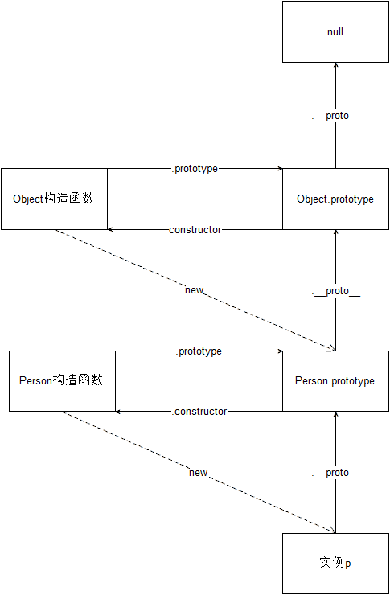
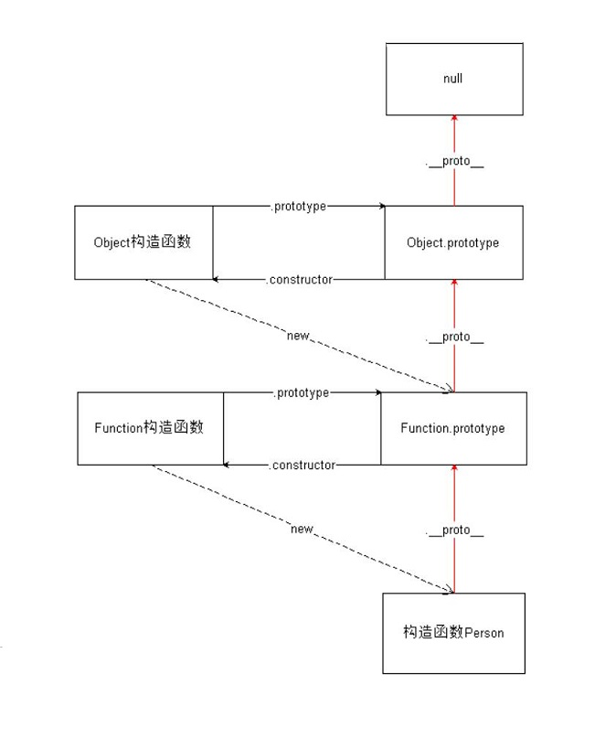
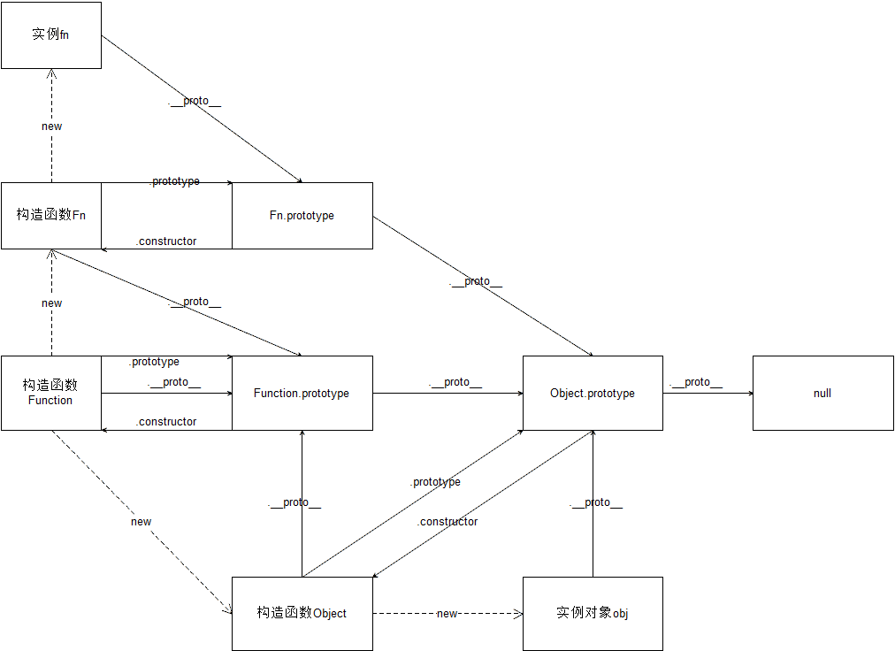

# JavaScript 高级


## 面向对象编程

### 基本概念

> Everything is object （万物皆对象）

对象到底是什么，我们可以从两次层次来理解

**(1) 对象是具体事物的抽象**

一本书、一辆汽车、一个人都可以是对象，当实物被抽象成对象，实物之间的关系就变成了对象之间的关系，从而就可以模拟现实情况，针对对象进行编程

问： 书是对象吗

**(2)对象是无序键值对的集合，其属性可以包含基本值、对象或者函数**

每个对象都是基于一个引用类型创建的，这些类型可以是系统内置的原生类型，也可以是开发人员自定义的类型

### 什么是面向对象？

面向对象编程 —— Object Oriented Programming，简称 OOP ，是一种编程开发思想

在面向对象程序开发思想中，每一个对象都是功能中心，具有明确分工，可以完成接受信息、处理数据、发出信息等任务
因此，面向对象编程具有灵活、代码可复用、高度模块化等特点，容易维护和开发，比起由一系列函数或指令组成的传统的过程式编程（procedural programming），更适合多人合作的大型软件项目

**面向对象与面向过程：**

- 面向过程就是亲历亲为，事无巨细，有条不紊，面向过程是解决问题的一种思维方式，（执行者的角度）
  - 关注点在于解决问题的过程（先 xx，然后 xx，在 xx）
- 面向对象就是找一个对象，让她去做这件事情（指挥者的角度）
  - 关注点在找到能解决问题的对象上
- 面向对象不是面向过程的替代，而是面向过程的封装

**面向对象的特性：**

- 封装性
  - 将功能的具体实现，全部封装到对象的内部，外界使用对象时，只需要关注对象提供的方法如何使用，而不需要关心对象的内部具体实现，这就是封装
- 继承性
  - 在 js 中，继承的概念很简单，一个对象没有的一些属性和方法，另外一个对象有，拿过来用，就实现了继承
  - **注意：在其他语言里面，继承是类与类之间的关系，在 js 中，是对象与对象之间的关系**
- [多态性]
  - 多态是在强类型的语言中才有的；js 是弱类型语言，所以 js 不支持多态

## 创建对象的方式

### 内置构造函数创建

我们可以直接通过 `new Object()` 创建：

```javascript
// 在 js 中，对象有动态特性，可以随时的给一个对象增加属性或者删除属性
var person = new Object()
person.name = 'zs'
person.age = 18
person.sayName = function() {
  console.log(this.name)
}
```

缺点：麻烦，每个属性都需要添加

### 对象字面量创建

```javascript
var person = {
  name: 'zs',
  age: 18,
  sayName: function() {
    console.log(this.name)
  }
}
```

缺点：无法批量生成多个对象，代码冗余

### 简单改进：工厂函数

我们可以写一个函数，解决代码重复问题

```javascript
function createPerson(name, age) {
  return {
    name: name,
    age: age,
    sayName: function() {
      console.log(this.name)
    }
  }
}
```

然后生成实例对象：

```javascript
var p1 = createPerson('zs', 18)
var p2 = createPerson('ls', 18)
```

缺点：没有解决对象识别的问题，创建出来的对象都是 Object 类型的

### 继续改进：自定义构造函数

构造函数是一个函数，用于实例化对象，需要配合 new 操作符使用

```javascript
function Person(name, age) {
  this.name = name
  this.age = age
  this.sayName = function() {
    console.log(this.name)
  }
}
var p1 = new Person('zs', 18)
p1.sayName() // zs
var p2 = new Person('ls', 23)
p2.sayName() // ls
```

### 构造函数的缺点

使用构造函数带来的最大的好处就是创建对象更方便了，但是其本身也存在一个浪费内存的问题：

```javascript
function Person(name, age) {
  this.name = name
  this.age = age
  this.sayHello = function() {
    console.log('hello' + this.name)
  }
}
var p1 = new Person('zs', 18)
var p2 = new Person('ls', 16)
console.log(p1.sayHello === p2.sayHello) // false
```

解决方案：

```javascript
function sayHello() {
  console.log('hello ' + this.name)
}
function Person(name, age) {
  this.name = name
  this.age = age
  this.sayHello = sayHello
}

var p1 = new Person('zs', 18)
var p2 = new Person('ls', 16)
console.log(p1.sayHello === p2.sayHello) // true
```

缺点：会暴漏很多的函数，容易造成全局变量污染

> 术语：
>
> 1. 实例（实例对象）：通过构造函数创建出来的对象，叫做实例，实例可以有多个
> 2. 实例化：构造函数创建对象的过程
> 3. 成员：对象的属性和方法

## 原型

### 原型基本概念

Javascript 规定，每一个函数都有一个 `prototype` 属性，属性值是一个对象，这个对象就叫做原型（原型对象），这个对象的所有属性和方法，都会被构造函数的实例继承

这也就意味着，我们可以把所有对象实例需要共享的属性和方法直接定义在 `prototype` 对象上

```javascript
function Person (name, age) {
  this.name = name
  this.age = age
}

console.log(Person.prototype)
Person.prototype.sayName = function () {
  console.log(this.name)
}
var p1 = new Person(...)
var p2 = new Person(...)
console.log(p1.sayName === p2.sayName) // true
```

这时所有实例的 `sayName()` 方法，其实都指向同一个内存地址

### `__proto__`

任意对象都有 `__proto__` 属性，这个属性指向了构造函数的 prototype 属性，也就是原型对象

获取原型对象：

- 通过 `构造函数.prototype` 可以获取
- 通过 `实例.__proto__` 可以获取（隐式原型）
- 它们指向了同一个对象 `构造函数.prototype === 实例.__proto__`

**注意：`__proto__`是浏览器的一个隐藏（私有）属性，IE 浏览器不支持，不要通过它来修改原型里的内容，如果要修改原型中的内容，使用 `构造函数.prototype` 去修改**

### constructor 属性

默认情况下，原型对象中只包含了一个属性：constructor，constructor 属性指向了当前原型对象的构造函数

```javascript
function Person() {}

console.log(Person.prototype)
console.log(Person.prototype.constructor) // 构造函数本身

var p = new Person()
console.log(p)
// p 实例对象没有constructor 属性， 该属性来源于原型上
console.log(p.constructor == Person.prototype.constructor) // true
```

### 构造函数、实例、原型三者之间的关系

构造函数：构造函数就是一个函数，配合 new 可以新建对象

实例：通过构造函数实例化出来的对象我们把它叫做构造函数的实例。一个构造函数可以有很多实例

原型：每一个构造函数都有一个属性`prototype`，函数的 prototype 属性值就是原型。通过构造函数创建出来的实例能够直接使用原型上的属性和方法


原型三角关系：

- 构造函数和原型：配偶关系

  - 构造函数（妈妈），通过 prototype 属性访问原型（爸爸）
  - 原型通过 constructor 属性访问到构造函数

- 构造函数 和 实例对象：母子关系

  - 构造函数可以创建实例对象
  - 实例对象不能直接访问到构造函数

- 原型 和 实例对象关系：父子关系
  - 实例对象可以直接访问到原型上的所有成员
  - 实例对象可以间接的访问到构造函数（通过原型上的 constructor 属性）

## 原型链

### 原型链概念

任何一个对象，都有原型对象，原型对象本身又是一个对象，所以原型对象也有自己的原型对象，这样形成的链式结构，就是原型链

绘制对象的原型链结构：

```javascript
var p = new Person()
// p ==> Person.prototype  ==> Object.prototype ==> null
var o = new Object()
// o ==> Object.prototype ==> null
var arr = new Array()
// arr ==> Array.prototype ==> Object.prototype ==> null
var date = new Date()
// date ==> Date.prototype ==> Object.prototype ==> null

// Math 是个内置对象，不是个构造函数
// Math ==> Object.prototype ==> null
```

总结：Object.prototype 是原型链的尽头，Object.prototype 的原型是 null



### 属性查找原则

**属性搜索（查找）原则： 沿着原型链进行查找**

1. 首先在当前对象上查找是否有该属性，如果有，直接返回属性值
2. 如果没有，去对象的原型上查找，如果有，直接返回属性值
3. 如果也没有， 沿着原型链进行查找，直到 Object.prototype ，如果找到了，就返回属性值，如果还没有，返回 undefined

**属性修改（设置）原则：**

1. 只会修改对象自身的属性
2. 如果自身没有这个属性，那么就会添加这个属性，并不会修改原型中的属性

```javascript
function Person(name, age) {
  this.name = name
  this.age = age
}
Person.prototype.name = 'zs'
Object.prototype.gender = 'male'

var p = new Person('ls', 19)
var p1 = new Person()
console.log(p)

// p 的原型链：
// p ==> Person.prototype ==> Object.prototype ==> null

console.log(p.name) // ls
console.log(p.age) // 19
console.log(p.gender) // male
console.log(p.sex) // undefined

console.log(p1.name) // undefined
console.log(p1.age) // undefined
// p1 对象依旧有 name 和age 属性， 只不过属性值都是 undefined
console.log(p1.gender) // male
console.log(p1.sex) // undefined

p.gender = '不详'
console.log(p.gender) // 不详

p.name = 'ww'
console.log(p.name) // ww
```

### Object.prototype 成员介绍

> 任何对象的原型链上都有 Object.prototype，根据属性搜索原则(沿着原型链进行查找)，任何对象都可以访问到 Object.prototype 上的成员

constructor：指向了构造函数 Object

#### `hasOwnProperty`

`hasOwnProperty()` 方法会返回一个布尔值，判断对象自身是否具有该属性

```javascript
var obj = {
  name: 'zs'
}
// 判断name属性是不是obj自己提供的
console.log(obj.hasOwnProperty('name')) // true
console.log(obj.hasOwnProperty('toString')) // false
```

**`hasOwnProperty` 与 `in` 的区别**

1. `in` 操作符：判断对象能否访问到该属性（不管这个属性是自己提供的，还是从原型上继承来的），如果可以访问到， 都会返回 true

2. `hasOwnProperty`：该属性必须是自己提供，才返回 true，否则返回 false

**hasOwnProperty 的使用场景**：用在 for...in 循环中

```javascript
for (var k in p) {
  // 可以遍历到对象自身的属性以及对象原型链上的属性
  console.log(k)

  // 只遍历得到对象自身的属性，if 条件过滤下
  // if (p.hasOwnProperty(k)) {
  // 		console.log(k)
  // }
}
```

#### `isPrototypeOf`

`isPrototypeOf()` 方法用于测试一个对象是否存在于另一个对象的原型链上

```javascript
// 判断 A 对象是否在 B 对象的原型链上
// 返回值：true，在原型链上  false：不在原型链上
A.isPrototetypeOf(B)

function Person() {}
var p = new Person()

// p 的原型链：
// p ==> Person.prototype ==> Object.prototype ==> null

console.log(Person.isPrototypeOf(p)) // false Person 是构造函数
console.log(Person.prototype.isPrototypeOf(p)) // true
console.log(Object.prototype.isPrototypeOf(p)) // true
```

**`isPropertyOf` 与 `instanceof` 运算符的区别**

`instanceof` 运算符用来测试一个对象的原型链中是否存在一个构造函数的 `prototype` 属性。作用和 isPrototypeOf 类似

语法： 实例对象 instanceof 构造函数

作用：构造函数的 prototype 属性是否在实例对象的原型链上

- A.isPrototypeOf(B) 判断 A 是否在 B 的原型链上 A： 是一个原型对象
- B instanceof A 判断 A 的 prototype 是否在 B 的原型链上 A：是一个构造函数

```javascript
console.log(Array.isPrototypeOf([])) // false
console.log(Array.prototype.isPrototypeOf([])) // true

console.log([] instanceof Array) // true
console.log([] instanceof Array.prototype) // 语法错误，instanceof 的右边是个构造函数
```

#### `propertyIsEnumerable`

`propertyIsEnumerable()` 方法返回一个布尔值，表明指定的属性名是否是当前对象可枚举的自身属性

```javascript
function Person(name) {
  this.name = name
}
Person.prototype.age = 19
var p = new Person('lw')
console.log(p.propertyIsEnumerable('name')) // true
console.log(p.propertyIsEnumerable('age')) // false
```

拓展：给对象添加不可遍历的属性 : `Object.defineProperty()`

```javascript
// 语法： Object.defineProperty(obj, prop, desc)
// 参数：
// obj： 给哪个对象添加属性
// prop：属性， 类型是字符串
// desc： 属性描述符， 类型是个对象

// 作用： 定义对象的属性特征

var obj = {
  name: 'zs',
  age: 19
}
// 给obj 添加一个不可遍历的 gender 属性
Object.defineProperty(obj, 'gender', {
  value: 'female', // 配置该属性的默认值
  writable: true, // 配置该属性是否可以被修改， 默认值是false， 不可修改
  enumerable: true // 配置该属性是否可遍历， 默认值是false， 不可遍历
})
obj.gender = 'male'
console.log(obj)
console.log(obj.propertyIsEnumerable('gender')) // false
```

#### toString/toLocaleString

返回对象的字符串格式

> 每个内置对象的原型上都有属于自己的 toString 方法

```javascript
var obj = {
  name: 'zs',
  age: 19
}
// obj ==> Object.prototype ==> null
console.log(obj.toString()) // '[object Object]'
console.log(obj.toLocaleString()) // '[object Object]'

var arr = [1, 2, 3]
// arr ==>  Array.prototype ==> Object.prototype ==> null
//           toString()         toString()
console.log(Array.prototype) // 含有自己的 toString 方法
console.log(arr.toString()) // '1,2,3'
console.log(arr.toLocaleString()) // '1,2,3'

var date = new Date()
//  date ==> Date.prototype ==> Object.prototype ==> null
//           toString()          toString()
console.log(Date.prototype) // 含有自己的 toString 方法
console.log(date.toString()) // Wed Oct 10 2018 16:00:51 GMT+0800 (中国标准时间)
console.log(date.toLocaleString()) // 2018/10/10 下午4:00:51 得到的是本地时间格式
```

#### valueOf

语法：对象.valueOf()

作用： 返回对象的原始值（简单数据类型），默认的 valueOf 方法（Object.prototype 上的 valueOf 方法）只会返回对象自身；日期对象的 valueOf 方法返回的是时间戳，因为 Date 的原型链上有自己的 valueOf 方法，该 valueOf 的作用就是返回日期的时间戳

```javascript
var obj = {
  name: 'zs',
  age: 19
}
// obj ==> Object.prototype ==> null
console.log(obj.valueOf()) // obj

var arr = [1, 2, 3]
// arr ==>  Array.prototype ==> Object.prototype ==> null
console.log(arr.valueOf()) // arr

var date = new Date()
// date 原型链
// date ==> Date.prototype ==> Object.prototype ==> null
console.log(Date.prototype) // 含有 valueOf 方法
console.log(date.valueOf()) // 时间戳
```

#### valueOf 和 toString 的应用

当对象在参与运算和比较的时候，js 内部会自动的调用 valueOf 和 toString 方法

调用规则：

1. 默认先调用 vauleOf， 尝试将对象转成简单数据类型， 如果没有转成简单数据类型， 会继续在调用 toString 方法

2. 如果 valueOf 和 toString 方法都没有转成简单数据类型，会报错

## 沙箱模式

沙箱其实就是一个独立的环境，这个环境中任何的改变，都不会对外部环境产生影响

函数自调用一样，在自调用函数内部的变量是不会影响到外部的，因此**函数自调用模式也叫沙箱模式**

```javascript
;(function(window) {
  var fn = function() {
    console.log('这是fn函数')
  }
})(window)
```

1. 代码写在自调用函数里面，减少全局污染
2. 想要在外面使用 fn 函数，可将 fn 暴露到全局 `window.fn = fn;` 将 fn 函数的地址赋值给了 window 上的 fn 属性
3. 一般，我们一个 js 文件只会暴露一个核心的功能（函数、方法）： 目的还是为了减少全局污染

## 严格模式

- 语法：`'use strict'`
- 作用：让 js 引擎以更加严格的模式执行 js 代码
- 最佳实践：在某个函数内部开启严格模式，而不是在全局环境中开启
- 注意：
  - 严格模式只对当前作用域起作用
  - 应该**在当前作用域最顶端使用`use strict`，否则严格模式无效**
- 使用严格模式好处：
  - 规范
  - 提高代码执行效率

```js
// 严格模式应该配合沙箱模式一起使用。

// 沙箱模式 + 严格模式：
;(function() {
  'use strict'

})()
```

### 严格模式规定

- 变量必须显示声明
- 函数参数不能重名
- 禁止使用八进制
- 不能使用保留字作为变量名称：`implements, interface, let, package, private, protected, public, static, yield`
- 如果不符合上述规范，会直接报错

## 继承

> 继承：子承父业

在 js 中的继承概念非常简单，拿来主义：一个对象自己没有的属性和方法，另一个对象有，拿过来使用，就实现了继承。

继承的目的：让一个对象可以使用另一个对象的属性和方法。

### 混入式继承（mixin）

> 把一个对象中的属性和方法拷贝到另一个对象中。

```javascript
var ls = {
  name: 'zs',
  extend: function(obj) {
    // 只拷贝对象obj自身的成员，原型链上的成员不用拷贝给this
    if (obj.hasOwnProperty(k)) {
      this[k] = obj[k]
    }
  }
}
```

### 原型链继承

一个对象可以访问构造函数的原型中的属性和方法，那么如果想要让一个对象增加某些属性和方法，

只需要把这些属性和方法放到原型对象中即可。这样就实现了继承, 称之为原型链继承

- 直接给原型增加属性和方法
- 原型替换（注意：constructor）
- mixin+原型替换

```javascript
function Person() {}

// 1. 直接给原型增加属性和方法（麻烦）
Person.prototype.color = 'lime'
Person.prototype.legs = 2
Person.prototype.sayHi = function() {
  console.log('sayHi')
}
// 2. 原型替换，将原型替换成一个对象
Person.prototype = {
  // 手动添加一个constructor属性，如果不手动添加，会找到 Object 的 constructor 属性
  constructor: Person,

  color: 'lime',
  legs: 2,
  sayHi: function() {
    console.log('sayHi')
  }
}
// 3. 原型链 + 混入式继承
function Person() {}
var lw = {
  skill: '翻墙'
}
// 给原型添加 extend 方法  -- 混入式继承
Person.prototype.extend = function(obj) {
  for (var k in obj) {
    if (obj.hasOwnProperty(k)) {
      this[k] = obj[k]
    }
  }
}
// 把 lw 的成员添加到了 Person 的原型上， Person 的实例就可以访问到原型上的这个成员
Person.prototype.extend(lw)
console.log(Person.prototype)
var p = new Person()
console.log(p.skill)
```

### Object.create

> 最初是由道格拉斯丶克罗克福德发布的一篇文章提出的，ECMAScript5 新增了 Object.create() 方法来规范化了这种继承

ES5 中新增了一个方法 `Object.create()`，方法会使用指定的原型对象及其属性去创建一个新的对象

```javascript
// 参数：proto 一个对象
// 返回值：obj 新对象，新对象的原型就是 proto
var obj = Object.create(proto)
console.log(obj)
```

## 函数进阶

### 定义函数的三种方式

#### 函数声明

```javascript
fn() // 函数声明可以先调用，在声明
function fn() {
  console.log('这是函数声明')
}
```

#### 函数表达式

```javascript
var fn = function() {
  console.log('这是函数表达式')
}
fn() // 函数表达式必须先声明，再调用
```

#### 构造函数 Function

```javascript
// 函数也是对象，可以使用 Function 构造函数 new 出来
// 相当于var fn = function () {}
var fn = new Function()

// 语法：new Function(arg1,arg2,arg3..,body)
// 1. 所有的参数都是字符串类型
// 2. 前面可以定义任意多个形参，最后一个参数是代码体
var fn = new Function('alert(1)')
fn()

var fn1 = new Function('a1', 'a2', 'alert(a1 + a2)')
fn1(1, 2)
```

【案例：代码实时预览效果.html】

#### eval 函数--了解

> eval 可以和 new Function 一样，执行字符串代码

注意：eval 函数的功能非常的强大，但是实际使用的情况并不多。

```javascript
eval('var num = 10; console.log(num)') // 10
```

- eval 形式的代码难以阅读
- eval 形式的代码无法打断点，因为本质还是还是一个字符串
- 在浏览器端执行任意的 JavaScript 会带来潜在的安全风险，恶意的 JavaScript 代码可能会破坏应用，特别是在用它执行用户输入数据的情况下。可能会有恶意用户输入威胁你的站点或应用程序安全的代码（即所谓的代码注入）
  [推荐了解下 xss 攻击](http://qingbob.com/Excess-XSS/)

### 函数的四种调用模式

分析 this 的指向问题

1. 任何函数都有属于自己的 this
2. this 是动态的，this 在函数声明的时候是确定不了的，只有当函数被调用了才能够确定 this 的指向，this 的指向和函数在哪被调用没有关系

分析 this 的问题的思路：

1. this 是属于哪个函数
2. **这个函数是何种调用模式**

```
函数：当一个函数不是一个对象的属性时，我们称之为函数
方法：当一个函数被保存为对象的一个属性时，我们称之为方法
```

#### 函数调用模式

<font color="red">如果一个函数不是一个对象的属性时，就是被当做一个函数来进行调用的。此时 this 指向了 window</font>

```javascript
// 函数名() 的调用方式
function fn() {
  console.log(this) // 指向window
}
fn()
```

#### 方法调用模式

<font color="red">当一个函数被保存为对象的一个属性时，我们称之为一个方法。当一个方法被调用时，this 被绑定到当前对象</font>

```javascript
// 通过点语法或者中括号语法来访问方法，都是属于方法调用模式
var f = function() {
  console.log(this)
}
var obj = {
  a: 1,
  fn: f
}
obj.fn() // obj
obj['fn']() // obj

var arr = [f, 10, 30]
// 也是方法调用模式
arr[0]() // arr
```

#### 构造函数调用模式

<font color="red">如果函数是通过 new 关键字进行调用的，此时 this 被绑定到创建出来的新对象上</font>

```javascript
function Person() {
  console.log(this)
}
Person() // this 指向 window
var p = new Person() // this 指向 p
```

**总结：分析 this 的问题，主要就是区分函数的调用模式，看函数是怎么被调用的**

```javascript
// 分析思路：1. 看 this 是哪个函数的  2. 看这个函数是怎么调用的，处于什么调用模式
// 1.
var age = 38
var obj = {
  age: 18,
  getAge: function() {
    console.log(this.age)
  }
}
var f = obj.getAge
f() // window ==> 38

// 2.
var age = 38
var obj = {
  age: 18,
  getAge: function() {
    console.log(this.age) // obj ==> 18
    function foo() {
      console.log(this.age) // window ==> 38
    }
    foo()
  }
}
obj.getAge()
// obj['getAg']()

// 3.
var length = 10
var age = 18
function fn() {
  console.log(this.length)
}
var arr = [fn, '222']
fn() // 10
arr[0]() // 2

// 4.
var length = 10
function fn() {
  console.log(this.length)
}
var obj = {
  length: 5,
  method: function(fn) {
    fn() // window ==> 10
    arguments[0]() // argument ==> 3
  }
}
obj.method(fn, 10, 5)
```

#### 方法借用模式

> 上下文调用模式也叫方法借用模式，分为 apply，call ，bind
>
> 使用方法：`函数.call()` 或者 `函数.apply()`

任何函数都可以调用 apply，call ，bind 这三个方法

##### call 方法

call 方法可以调用一个函数，并且可以指定这个函数的 `this` 指向

```javascript
// call 方法也可以和 () 一样，进行函数调用
// 第一个参数：指定函数的 this，如果不传，则 this 指向 window
// 其余参数：和函数的参数列表一模一样
var zs = {
  name: 'zs',
  sayHi: function() {
    console.log('hello ,我是' + this.name)
  }
}
// zs.sayHi()
var ls = {
  name: 'ls'
}
// ls 借用 zs 的 sayHi 方法
zs.sayHi.call(ls)
```

##### 伪数组与数组

> 伪数组也叫类数组

1. 伪数组其实就是一个对象，但是跟数组一样，伪数组也会有`length`属性，也有`0, 1, 2, 3`等属性
2. 伪数组并没有数组的方法，不能使用`push/pop`等方法
3. 伪数组可以跟数组一样进行遍历，通过下标操作
4. 常见的伪数组：`arguments`、`document.getElementsByTagName的返回值`、`jQuery对象`

```javascript
var obj = {
  0: 'zs',
  1: 'ls',
  2: 'ww',
  length: 3
}
```

- 伪数组借用数组的方法

```javascript
// 给 obj 添加一项 3: 'zl'
Array.prototype.push.call(obj, 'zl')
// 把 obj 中的每一项使用 '-' 拼接起来返回一个字符串
Array.prototype.join.call(obj, '-')
```

- 将伪数组转换成真数组

```javascript
var arr = Array.prototype.slice.call(obj)
```

##### apply 方法

```
apply 的语法：
apply(thisArg, 实参列表)
thisArg ==> 改变函数内的 this 指向的
实参列表 ==> 是一个数组或者是伪数组
```

> `apply()`方法的作用和 `call()`方法类似，只有一个区别，就是`apply()`方法接受的是**一个包含多个参数的数组**。而`call()`方法接受的是**若干个参数的列表**

```javascript
// 1. apply 能够调用函数
function fn() {
  console.log(1)
}
fn.apply() // 1

// 2. apply 改变 this 指向
function fn() {
  console.log(this)
}
fn.apply([10, 20, 30]) // [10, 20, 30]

// 3. apply 第二个参数是数组
function fn(n1, n2) {
  console.log(this)
  console.log(n1 + n2)
}
fn.apply({ name: 'zs' }, [10, 20]) // {name: 'zs'}, 30
// apply 的特性： 平铺性，把数组中的每一项取出来作为函数的实参
// fn.call({name: 'ls'}, 10, 20) // {}, 30
```

call 和 apply 的使用场景：

- 如果参数比较少，使用 call 会更加简洁
- 如果参数存放在数组中，此时需要使用 apply

课后练习：

```
求数组的最大值和最小值
封装一个函数，能够打印出来所有的参数
```

##### bind 方法

**bind() **方法创建一个新的函数、可以绑定新的函数的`this`指向

```javascript
// 返回值：新的函数(不会被调用)
// 参数：新函数的 this 指向，当绑定了新函数的 this 指向后，无论使用何种调用模式，this 都不会改变
// var newFn = fn.bind(window)
var fn = function() {
  console.log(this)
}

var newFn = fn.bind([1, 2, 3])
// newFn 是 bind 创建并返回出来的
console.log(newFn)
newFn() // this ==> [1,2,3]
```

#### 几种特殊的 this 指向

- 定时器中的 this 指向了 window，因为定时器的 function 最终是由 window 来调用的
- 事件中的 this 指向的是当前的元素，在事件触发的时候，浏览器让当前元素调用了 function

### 函数也是对象

> 函数是由 new Function 创建出来的，因此函数也是一个对象，`所有的函数都是 new Function 的实例`

#### 函数的原型链结构

```javascript
// 内部：var Person = new Function()
function Person() {}
// Person 实例对象的原型链：
// Person ==> Function.prototype ==> Object.prototype ==> null
// Function.prototype 原型类型是个函数
console.dir(Function.prototype)
```



#### Function.prototype 成员

- arguments：获取函数的实参，已经被废弃了，现在推荐的做法是使用函数内部可用的  `arguments`对象来访问函数的实参
  - （废弃的意思：已经从 Web 标准中删除，虽然一些浏览器目前仍然支持它，但也许会在未来的某个时间停止支持，请尽量不要使用该特性）
- length：获取形参的长度
- name：获取函数的名字，此属性不允许修改
- caller: 用于获取当前函数是在哪个函数中调用的，已经被废弃了
- constructor：指向当前构造函数，Function
- call：调用函数，重新指定 this
- apply：调用函数，重新指定 this
- bind：重新指向 this，返回一个新的函数，不调用
- toString : 得到函数的字符串格式

案例【封装 getType 函数（获取数据类型）】

```javascript
function getType(obj) {
  return Object.prototype.toString.call(obj).slice(8, -1) // '[object 构造函数]'
}
```

#### 完整版原型链

> 绘制完整版原型链的目的是辅助大家理解 js 中对象的继承关系



总结：

1. 所有函数都是 new Function 创建出来的，因此 `所有函数.__proto__` 都是 `Function.prototype`
2. 所有对象都是 new Object 创建出来的，因此 `所有对象.__proto__` 都是 `Object.prototype`

[参考链接](https://github.com/creeperyang/blog/issues/9)

### 作用域与预解析

#### 作用域

> 作用域：变量起作用的区域，也就是说：变量定义后，可以在哪个范围内使用该变量

**全局作用域** ：在 script 标签内，**函数外**的区域就是全局作用域，在全局作用内声明的变量叫做**全局变量** 。全局变量可以在任意地方访问。（if/while/for 语句中声明的变量也是全局变量）

**函数作用域** ：在函数内的区域叫做函数作用域，在函数作用域内声明的变量叫做**局部变量** ，局部变量只有在当前函数内才能访问到。

自由变量：对于一个函数来说，函数内部没有声明该变量，但在函数内部有访问该变量。对于这个函数来说， 该变量就是一个自由变量。

隐式全局变量：没有使用 var 定义的变量也是全局变量，叫做隐式全局变量。(不要使用)

```js
var num = 11
function fn() {
  var num1 = 22
  num2 = 33
  num = 33
  console.log(num1)
}
fn()
console.log(num)
// console.log(num1)
console.log(num2)
```

变量的查找规则：

- 函数内部可以使用函数外部的变量
- 有局部变量就用局部变量，没有局部变量就用全局变量。

**函数作用域是在函数定义的时候作用域就确定下来了，和函数在哪调用无关**

```js
var num = 123
function f1() {
  console.log(num)
}

function f2() {
  var num = 456
  f1()
}
f2() // 123

var num = 10
var num1 = 10

function test() {
  var num = 20
  num = 30 // num 在局部声明过，只能修改局部的 num 值
  num1 = 20 // 修改全局的 num1 值
  var num2 = 40
  num3 = 50 // 隐式全局
  console.log(num) // 30
  console.log(num1) // 20
  console.log(num2) // 40
  console.log(num3) // 50
}
test()
console.log(num) // 10
console.log(num1) // 20
// 如果 test 函数没执行过，则 num1 值为 10
console.log(num3) // 50
console.log(num2) // 报错
```

#### 作用域链

作用域链：只要是函数，就会形成一个作用域，如果这个函数被嵌套在其他函数中，那么外部函数也有自己的作用域，这个一直往上到全局环境，就形成了一个作用域链

`变量的搜索原则`：

1. 从当前作用域开始查找是否声明了该变量，如果存在，那么就直接返回这个变量的值
2. 如果不存在，就会往上一层作用域查询，如果存在，就返回
3. 如果不存在，一直查询到全局作用域，如果存在，就返回。如果在全局中也没有找到该变量会**报错**

```js
// 1.
var num = 10
fn1()
function fn1() {
  console.log(num) // undefined
  var num = 20
  console.log(num) // 20
}
console.log(num) // 10

// 2 -- 改造上面的面试题
var num = 10
fn1()
function fn1() {
  console.log(num) // 10
  num = 20
  console.log(num) // 20
}
console.log(num) // 20

// 3
var num = 123
function f1(num) {
  console.log(num) // 456 undefined
}
function f2() {
  var num = 456
  f1(num)
  f1()
}
f2()

// 4
var num1 = 10
var num2 = 20
function fn(num1) {
  num1 = 100
  num2 = 200
  num3 = 300
  console.log(num1) // 100
  console.log(num2) // 200
  console.log(num3) // 300
  var num3
}
fn()
console.log(num1) // 10
console.log(num2) // 200
console.log(num3) // error

// 5
var num = 1
function fn() {
  var num = 100
  num++
  console.log(num)
}
fn() // 101
fn() // 101
console.log(num) // 1

// 6.
var color = 'red' // blue
function outer() {
  var anotherColor = 'blue' // red
  function inner() {
    var tmpColor = color // red
    color = anotherColor
    anotherColor = tmpColor // red
    console.log(anotherColor) // red
  }
  inner()
}
outer()
console.log(color) // blue
```

#### 预解析

> 预解析：预先解析

js 执行代码分为两个过程：

- 预解析过程（变量与函数提升）
- 代码一行一行执行

预解析过程：JavaScript 解析器在执行代码前，会把所有变量的声明和函数的声明提升到当前作用域的顶部。例如`var a = 11`其实会分为`var a` 和`a = 11`两部分，其中`var a;`会被提升

预解析规则 :

1. var 声明的变量：只提升声明，不会提升赋值
2. 函数声明：整体提升
3. 先提升 var 声明的变量，后提升函数声明
4. 遇到重名的 var 声明， var 声明会被忽略，值会保留
5. 遇到重名的函数声明，后者会覆盖前者
6. 如果 var 声明和函数声明同名，函数声明会把 var 声明覆盖

```js
// 函数预解析
// 1.
function fn() {
  console.log(a) // undefined
}
fn()
var a = 1

// 2.
var n = 45
function fn5() {
  console.log(n) // undefined
  n = 20
  console.log(n) // 20
  var n = 0
  console.log(n) // 0
}
fn5()
console.log(n) // 45

// 3.
console.log(b) // 函数体
var b = 23
function b() {
  console.log(b)
}
console.log(b) // 23
// b() // 报错

// 4.
console.log(c) // 函数体
c() // 嘿嘿
var c = function() {
  comsole.log('哈哈')
}

function c() {
  console.log('嘿嘿')
}

// 5.
console.log(fn1) // 函数体
fn1()
function fn1() {
  console.log('哈哈') // 哈哈
}
console.log(fn2) // undefined
fn2() // 报错
var fn2 = function() {
  console.log('嘿嘿')
}
// 对于函数表达式，函数的调用必须在表达式声明之后
fn2() // 嘿嘿

// 6.
// 只有用 var 声明的变量才会预解析
console.log(d) // 报错
d = 5

// 7.
console.log(e)
console.log(f) // 报错
var e = f = 10
console.log(f) // 10

// 8.
if ('a' in window) {
  var a = 'abc'
}
console.log(a) // abc
```

**不要在一个作用域内重复的声明相同的变量和函数**

### 递归函数

> 递归函数：函数内部直接或者间接的调用自己

递归的要求：

1. 自己调用自己（直接或者间接）
2. 要有结束条件（出口）

递归函数主要是`化归思想`，将一个复杂的问题简单化，主要用于解决数学中的一些问题居多。

- 把要解决的问题，归结为已经解决的问题上。
- 一定要考虑什么时候结束让函数结束，也就是停止递归（一定要有已知条件）

练习：

```js
// 1. 计算1-100之间所有数的和
// 2. 计算斐波那契数列
function fn(n) {
  if (n == 1 || n == 2) {
    return 1
  }
  return fn(n - 1) + fn(n - 2)
}
console.log(fn(12))
```

#### 实现缓存

> 缓存（cache）：数据的缓冲区，当要读取数据时，先从缓冲中获取数据，如果找到了，直接获取，如果找不到，重新去请求数据

计算斐波那契数列，会有很大的性能问题，因为重复的计算了很多次，因此我们可以使用缓存来解决这个性能问题。

初级优化：

使用缓存的基本步骤：

- 如果要获取数据，先查询缓存，如果有就直接使用
- 如果没有，就进行计算，并且将计算后的结果放到缓存中，方便下次使用。

```javascript
// 缓存
var arr = []
var fbi = function(n) {
  count++
  if (n === 1 || n === 2) {
    return 1
  }
  if (arr[n]) {
    return arr[n]
  } else {
    var temp = fbi(n - 1) + fbi(n - 2)
    arr[n] = temp // 存入缓存
    return temp
  }
}
```

缺点：既然使用缓存，就需要保证缓存的数据的安全，不能被别人修改，因此，需要使用闭包来实现缓存的私有化。

## 闭包

### 闭包的基本概念

`闭包（closure）`是 JavaScript 语言的一个难点，也是 JavaScript 的一个特色，很多高级的应用都要依靠闭包来实现

> 闭包是函数和声明该函数的词法环境的组合

在 JavaScript 中，在函数中可以（嵌套）定义另一个函数时，如果内部的函数引用了外部的函数的变量，产生闭包

**闭包中包含了内部函数的代码，以及所需外部函数中的变量的引用 **

产生闭包的条件：有两个函数，是嵌套关系，内部函数引用了外部函数的变量，这样就会形成闭包

闭包的作用：

- 私有变量，保护数据安全
- 持久化维持数据

```javascript
// 闭包的基本模型
function outer() {
  var num = 10
  // function inner () {
  //   num++
  //   console.log(num)
  // }
  // return inner  // 把inner函数给返回出去，让外部能够调用inner函数
  // 上面的简写
  return function() {
    num++
    console.log(num)
  }
}
```

### 闭包的应用

#### 计数器

需求：统计一个函数的调用次数

```javascript
var count = 0
function fn() {
  count++
  console.log('我被调用了，调用次数是' + count)
}
fn()
fn()
fn()
// 缺点：count是全局变量，不安全
```

使用闭包解决这个问题！！！！

```javascript
function outer() {
  var count = 0 // 私有变量, 将 count 保护起来了
  function add() {
    count++
    console.log('当前count' + count)
  }
  return add
}
var result = outer()
result()
```

【案例：银行存钱取钱】

#### 缓存的私有化

> 缓存（cache）：数据的缓冲区，当要读取数据时，先从缓冲中获取数据，如果找到了，直接获取，如果找不到，重新去请求数据。

计算斐波那契数列，会有很大的性能问题，因为重复的计算了很多次，因此我们可以使用缓存来解决这个性能问题。

缺点：既然使用缓存，就需要保证缓存的数据的安全，不能被别人修改，因此，需要使用闭包来实现缓存的私有化。

```javascript
function outer() {
  // 缓存
  var arr = []

  var fbi = function(n) {
    if (n == 1 || n == 2) {
      return 1
    }
    if (arr[n]) {
      return arr[n]
    } else {
      var temp = fbi(n - 1) + fbi(n - 2)
      arr[n] = temp //存入缓存
      return temp
    }
  }
  return fbi
}
var fbi = outer()
console.log(fbi(40))
```

### 闭包存在的问题

> 正常情况下：函数在调用的时候，去开辟一块内存空间用来执行内部的代码，当函数调用结束的时候，要销毁开辟的空间，节省内存
>
> 闭包占用的内存是不会被释放的，因此，如果滥用闭包，会造成内存泄漏的问题。闭包很强大，但是只有在必须使用闭包的时候才使用

#### js 的垃圾回收机制(了解)

- 内存：计算机中所有程序的运行都是在`内存` 中进行的，因此内存的性能对计算机的影响非常大，运行程序需要消耗内存，当程序结束时，内存会得到释放。
- javascript 分配内存：当我们定义变量，javascript 自动分配内存存储数据。无论是值类型或者是引用类型，都需要存储在内存中。
- 垃圾回收：当代码执行结束，分配的内存已经不需要了，这时候需要将内存进行回收，在 javascript 语言中，`垃圾回收机器`会帮我们回收`不再需要使用`的内存。

##### 引用记数法清除

引用记数垃圾收集：如果没有引用指向某个对象（或者是函数作用域），那么这个对象或者函数作用域就会被垃圾回收机制回收。

```javascript
var o = {
  name: 'zs'
}
// 对象被 o 变量引用，引用记数 1
var obj = o // 变量被 o 和 obj 引用，引用记数 2
o = 1 // o 不在引用对象了，引用记数 1
obj = null // obj 不在引用对象了，引用记数 0，可以被垃圾回收了
```

引用计数法无法解决循环引用导致的内存泄露

```javascript
function fn() {
  var obj1 = {} // 引用计数为 2
  var obj2 = {} // 引用计数为 2
  obj1.a = obj2
  obj2.b = obj1
}
fn() // 销毁fn调用开辟的空间， 但是由于引用计数考虑到两个对象都不是零引用的对象，就不能够被垃圾回收机制给回收掉
```

##### 标记清除法清除

使用引用计数法进行垃圾回收的时候，会出现循环引用导致内存泄漏的问题。因此现代的浏览器都采用标记清除法来进行垃圾回收。

这个算法假定设置一个叫做根（root）的对象（在 Javascript 里，根是全局对象 Window）。定期的，垃圾回收器将从根开始，找所有从根开始引用的对象，然后找这些对象引用的对象……从根开始，垃圾回收器将找到所有可以获得的对象和所有不能获得的对象。

**从 2012 年起，所有现代浏览器都使用了标记 - 清除垃圾回收算法。**

#### 闭包占用内存释放

当闭包的功能不在需要使用了，将这个变量指向 `null`， 这样闭包占用的内存就可以被回收掉了

```javascript
function outer() {
  var count = 0
  function fn() {
    count++
    console.log('执行次数' + count)
  }
  return fn
}
var result = outer()
result()
result = null // 当函数 fn 没有被变量引用了，那么函数 fn 就会被回收，函数 fn 一旦被回收，那么 outer调用形成的作用域也就得到了释放
```

## 正则表达式

> 正则表达式(regular expression)描述了一种字符串匹配的模式（pattern），可以用来检查一个串是否含有某种子串（数据验证）、将匹配的子串替换（数据删除或替换）或者从某个串中取出符合某个条件的子串等（数据提取）

### 创建正则表达式

- 构造函数的方式

```js
// RegExp(regular expression)
var reg = new RegExp(/a/) // 匹配字母中有 a
```

- 正则字面量

```javascript
var reg = /a/
```

正则有 test 方法，作用是测试字符串是否符合正则表达式的规律，如果符合， 返回 true

```js
console.log(reg.test('abc')) // true
console.log(reg.test('def')) // false
```

### 元字符

> 正则表达式由一些普通字符和元字符组成，普通字符包括大小写字母、数字等，而元字符则具有特殊的含义

#### 常见元字符

`\d` 匹配一个数字字符。等价于 `[0-9]`

`\D` 匹配一个非数字字符。等价于 `[^0-9]`

`\w` 匹配包括下划线的任何单词字符。等价于`[A-Za-z0-9_]`

`\W` 匹配任何非单词字符。等价于 `[^A-Za-z0-9_]`

`\s` 匹配任何空白字符，包括空格、制表符、换页符等等。等价于 `[\f\n\r\t\v]`

`\S` 匹配任何非空白字符。等价于 `[^\f\n\r\t\v]`

`\` 将下一个字符标记为或特殊字符、或原义字符、或向后引用、或八进制转义符。例如， `n` 匹配字符 `n`。`\n` 匹配换行符。`\\` 匹配 `\`，`\(` 则匹配 `(`。

`.` 匹配除换行符 `\n` 之外的任何单字符。要匹配包括 '\n' 在内的任何字符，可用`(.|\n)`

`|` 指明两项之间的一个选择。，优先级最低，| 的左右都是单独的整体

`()` 优先级最高，标记一个子表达式的开始和结束位置。子表达式可以获取供以后使用。使用 $0…$9 属性。要匹配这些字符，请使用 `\(` 和 `\)` 。每个()就是一个子匹配 '\1'和'\$1'用来指定第一个子匹配

```javascript
/f|boot/ // 匹配 `f` 和 `boot`
/(f|b)oot/ // 匹配 `foot` 和 `boot`
```

#### 空白字符

- `\f` 匹配一个换页符
- `\n` 匹配一个换行符
- `\r` 匹配一个回车符
- `\t` 匹配一个制表符
- `\v` 匹配一个垂直制表符

#### 字符类的元字符

- `[]` 在正则表达式中表示 **单个** 字符的位置，[] 里面写这个位置可以出现的字符。

```javascript
/[abc]/ // 匹配 a,b,c 任意一个字符
```

- `[^]` 在中扩号中的 `^` 表示非的意思。

```javascript
// ^ 在方括号表达式开头中使用，此时它表示不接受该字符集合
/[^abc]/ // 匹配除了a，b，c以外的其他字符
```

- `[a-z]` `[1-9]`表示范围

```javascript
/[a-z]/ // 小写字母
/[A-Z]/ // 大写字母
/[0-9]/ // 数字
/[a-zA-Z0-9]/ // 所有的小写字母和大写字母以及数字
```

#### 边界类元字符

> 我们前面学习的正则只要有满足的条件的就会返回 true，并不能做到精确的匹配。

- `^` 匹配输入字符串的开始位置

- `$` 匹配输入字符串的结尾位置

```javascript
/^chuan/ // 以chuan开头
/chuan$/ // 以chuan结尾
/^chuan$/ // 精确匹配 chuan

//精确匹配chuan,表示必须是这个
console.log(/^chuan$/.test('chuanchuan')) // fasle
```

> 以后表单校验要精确匹配

- `\b` 匹配一个字边界，即字与空格间的位置。如果它位于要匹配的字符串的开始，它在单词的开始处查找匹配项。如果它位于字符串的结尾，它在单词的结尾处查找匹配项。
  - Chapter：
    `/\bCha/` : 匹配 Chapter 的开头三个字符
    `/ter\b/` : 匹配 Chapter 的结尾三个字符
- `\B` 表示非单词边界。位置并不重要，因为匹配不关心究竟是单词的开头还是结尾。
  下面的表达式匹配 Chapter 中的字符串 apt，但不匹配 aptitude 中的字符串 apt
  `/\Bapt/`

#### 量词类元字符

> 量词用来控制出现的次数，一般来说量词和边界会一起使用

- `*` 匹配前面的子表达式零次或多次，等价于 `{0,}`
- `+` 匹配前面的子表达式一次或多次，等价于 `{1,}`
- `?` 匹配前面的子表达式零次或一次，等价于 `{0,1}` 。当该字符紧跟在任何一个其他限制符 (`*`, `+`,`?`, `{n}`, `{n,}`, `{n,m})` 后面时，匹配模式是非贪婪的。非贪婪模式尽可能少的匹配所搜索的字符串，而默认的贪婪模式则尽可能多的匹配所搜索的字符串
- `{n}` n 是一个非负整数。匹配确定的 `n` 次。
- `{n,}` n 是一个非负整数。至少匹配 `n` 次。
- `{n,m}` `m` 和 `n` 均为非负整数，其中`n` <= `m`。最少匹配 `n` 次且最多匹配 `m` 次。

```javascript
// {} 就近修饰单个字符
console.log(/chuan{2}/.test('chuanchuan')) // false
console.log(/(chuan){2}/.test('chuanchuan')) // true
console.log(/chuan{2}/.test('chuann')) // true
```

#### 其他字符

- `g` 全局标记，指定将该表达式应用到输入字符串中能够查找到的尽可能多的匹配
- `i` 标记指定不区分大小写。表达式的结尾处

### 优先级

从高到低的优先级顺序：

1. **`\`** 转义符
2. **`()`**, **`(?:)`** , **`(?=)`**, **`[]`** 圆括号和方括号
3. **`*`**, **`+`** , **`?`**, **`{n}`**, **`{n,}`**, **`{n,m}`** 限定符
4. **`^`**, **`$`**, **`\任何元字符、任何字符`** 定位点和序列（即：位置和顺序）
5. **`|`** 替换，"或"操作

> 字符具有高于替换运算符的优先级，使得"m|food"匹配"m"或"food"。若要匹配"mood"或"food"，请使用括号创建子表达式，从而产生"(m|f)ood"。

### 正则的使用

#### 字符串使用正则

- `replace()`

```javascript
var str = '   123AD  asadf   asadfasf  adf  '
// 1. 替换掉字符串中的所有空白
var str2 = str.replace(/\s/g, '') // g: global, 全局搜索
// 2. 将所有的ad替换成xx
var str2 = str.replace(/ad/g, 'xx')
// 3. 将所有的ad/AD替换成xx
var str2 = str.replace(/ad/gi, 'xx') // i： ignore 忽略大小写

var str = 'abc,efg,123,abc,123,a'
// 4. 所有的逗号替换成句号
var str2 = str.replace(/,/g, '。')

var jsonStr = '[{"name":"张三",score:80},{"name":"张三",score:90},{"name":"张三",score:81}]'
// 5. 把所有成绩都修改成100分
var str2 = jsonStr.replace(/\d{1,2}/g, '100')
```

- `match()` ==> 匹配， 匹配符合正则表达式的字符

```javascript
var str2 = 'zs的手机号是18938383838, ls的手机号13989907890， ww的手机号是13848962389，zl的手机号是18970890908'
// 需求： 匹配出来所有的手机号, 返回了一个数组
var str3 = str2.match(/1[3-9]\d{9}/g)
console.log(str3)
```

#### 正则的方法

- test() ==> 测试字符串是否符合正则表达式的规律，符合，就返回 true

- exec() ==> 提取，提取字符串中符合正则表达式的字符，需要用括号分组， 如果没有进行分组，返回的是符合整个正则表达式的字符

```javascript
var str = '今天是2018-10-16，我这里的需求是提取出年月日'
// var reg = /\d{4}-\d{2}-\d{2}/;  ==>  符合整个正则表达式的字符
var reg = /(\d{4})-(\d{2})-(\d{2})/ // ==> 有分组存在 ，默认组名为 undefined
var reg2 = /(?<year>\d{4})-(?<month>\d{2})-(?<day>\d{2})/ // ?<组名> 添加组名
var ret = reg.exec(str) // 提取出分组的内容以下标的形式存在返回的数组里面
var ret2 = reg2.exec(str)
console.log(ret)
console.log(ret2)
// index 代表 匹配到 ret 在 str 中的下标
```

#### 实例

- `[xyz]` 字符集合。匹配所包含的任意一个字符。例如， '[abc]' 可以匹配 "plain" 中的 'a'。
- `[^xyz]` 负值字符集合。匹配未包含的任意字符。例如， '[^abc]' 可以匹配 "plain" 中的'p'、'l'、'i'、'n'。
- `[a-z]` 匹配所有小写字母
- `[-a-z]` 或 `[a-z-]` 匹配所有小写字母和 `-`
- `[A-Za-z0-9]` 匹配任何大写字母小写字母和数字
- `\b([a-z]+)\1\b/gi` 一个单词连续出现的位置。
- 将通用资源指示符 (URI) 分解为其组件

```javascript
var str = 'https://www.baidu.com:80/index.html'
var patt1 = /(\w+):\/\/([^/:]+)(:\d*)?([^# ]*)/
arr = str.match(patt1)
for (var i = 0; i < arr.length; i++) {
  document.write(arr[i])
  document.write('<br>')
}
//https://www.baidu.com:80/index.html
//https
//www.baidu.com
//:80
///index.html
```
