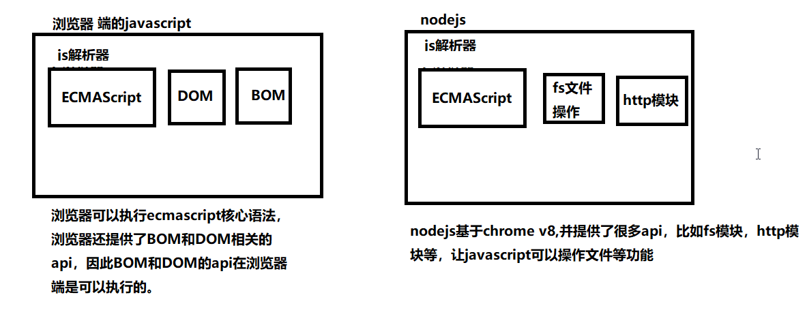

# nodejs基本介绍

## 为什么要学习nodejs

1. 降低编程语言切换的成本(nodejs实质上用的还是javascript)
2. NodeJS是前端项目的基础设施，前端项目中用到的大量工具 (大前端)
3. nodejs在处理高并发上有得天独厚的优势(利用nodejs做中间层)
4. 对于前端工程师，面试时对于nodejs有一定的要求

## node.js 是什么？

node.js，也叫作node，或者nodejs，指的都是一个平台

1. [node.js官方网站](https://nodejs.org/)
2. [node.js中文网](http://nodejs.cn/)
3. [node.js 中文社区](https://cnodejs.org/)

Node.js 是一个基于 Chrome V8 引擎的 JavaScript 运行环境，nodejs 允许 javascript 代码运行在服务端

```
1. nodejs不是一门新的编程语言，nodejs是在服务端运行javascript的运行环境
2. 运行环境：写得程序想要运行必须要有对应的运行环境
	php代码必须要有apache服务器
	在web端，浏览器就是javascript的运行环境
	在node端，nodejs就是javascript的运行环境
2. javascript并不只是能运行在浏览器端，浏览器端能够运行js是因为浏览器有js解析器，因此只需要有js解析器，任何软件都可以运行js。
3. nodejs可以在服务端运行js，因为nodejs是基于chrome v8的js引擎
```

**nodejs的本质：不是一门新的编程语言，nodejs是javascript运行在服务端的运行环境，编程语言还是javascript**

## nodejs与浏览器的区别

相同点：nodejs与浏览器都是js的运行环境，都能够解析js程序。对于ECMAScript语法来说，在nodejs和浏览器中都能运行

不同点：nodejs无法使用DOM和BOM的操作，浏览器无法执行nodejs中的文件操作等功能



## nodejs可以干什么？

1. 开发服务端程序
2. 开发命令行工具（CLI），比如npm，webpack，gulp，less，sass等
3. 开发桌面应用程序（借助 node-webkit、electron 等框架实现）


# 安装nodejs

## nodejs版本

下载地址

- [当前版本](https://nodejs.org/en/download/)
- [历史版本](https://nodejs.org/en/download/releases/)

官网术语解释

- LTS 版本：Long-term Support 版本，长期支持版，即稳定版。
- Current 版本：Latest Features 版本，最新版本，新特性会在该版本中最先加入

查看node版本

```bash
node -v
```


# 运行nodejs程序

## 方式一：使用node执行js文件

+ 创建js文件 `helloworld.js`

- 写nodejs的内容：`console.log('hello nodejs')`
- 打开命令窗口 `cmd`
  - shift加右键打开命令窗口，执行 `node 文件名.js`即可
- 执行命令：`node helloworld.js`

注意：在nodejs中是无法使用DOM和BOM的内容的，因此`document`， `window`等内容是无法使用的

## 方式二：REPL介绍

1. REPL 全称: Read-Eval-Print-Loop（交互式解释器）
   - R 读取 - 读取用户输入，解析输入了Javascript 数据结构并存储在内存中
   - E 执行 - 执行输入的数据结构
   - P 打印 - 输出结果
   - L 循环 - 循环操作以上步骤直到用户两次按下 ctrl-c 按钮退出
2. 在REPL中编写程序 （类似于浏览器开发人员工具中的控制台功能）
   - 直接在控制台输入 `node` 命令进入 REPL 环境
3. 按两次 Control + C 退出REPL界面 或者 输入 `.exit` 退出 REPL 界面
   - 按住 control 键不要放开, 然后按两下 c 键

## 环境变量

当要求系统运行一个**程序** 而没有告诉它程序所在的完整路径时

1. 首先在**当前目录**中查找和该字符串匹配的可执行文件
2. 进入用户 path 环境变量查找
3. 进入系统 path 环境变量查找

配置环境变量：

```javas
找到环境变量：计算机 --右键--> 属性 --> 高级系统设置 --> 高级 --> 环境变量
```


# global模块-全局变量

JavaScript 中有一个特殊的对象，称为全局对象（Global Object），它及其所有属性都可以在程序的任何地方访问，即全局变量。

在浏览器 JavaScript 中，通常 window 是全局对象， 而 Node.js 中的全局对象是 `global`，所有全局变量（除了 global 本身以外）都是 global 对象的属性。

在 Node.js 我们可以直接访问到 global 的属性，而不需要在应用中包含它。

**常用的 global 属性**

```javascript
console: 用于打印日志
setTimeout/clearTimeout: 设置清除延时器
setInterval/clearInterval: 设置清除定时器

__dirname: 当前文件的路径，不包括文件名
__filename：当前文件的路径，包括文件名

// 与模块化相关的，模块化的时候会用到
require
exports
module
```


# fs 模块

> fs 模块是 nodejs 中最常用的一个模块，因此掌握fs模块非常的有必要，fs模块的方法非常多，用到了哪个查哪个即可。
>
> 文档地址：http://nodejs.cn/api/fs.html

  在 nodejs 中，提供了 fs 模块，这是 node 的核心模块

  注意：

1. 除了 global 模块中的内容可以直接使用，其他模块都是需要加载的。
2. fs 模块不是全局的，不能直接使用。因此需要导入才能使用。

```javascript
const fs = require('fs')
```

## 读取文件

> 语法：fs.readFile(file[, options], callback)

方式一：不传编码参数

```javascript
// 参数1：文件路径
// 参数2：读取文件的回调函数
  // 参数1：错误对象，如果读取失败，err 会包含错误信息，如果读取成功，err 是 null
  // 参数2：读取成功后的数据（是一个Buffer对象）
fs.readFile('data.txt', function(err, data){
  console.log(err)
  console.log(data)
    console.log(data.toString()) // 将Buffer对象转换成字符串
})
```

方式二：传编码参数

```javascript
// 参数1：文件的路径
// 参数2：编码，如果设置了，返回一个字符串，如果没有设置，会返回一个buffer对象
// 参数3：回调函数
fs.readFile('data.txt', 'utf8', function (err, data) {
  console.log(err)
  console.log(data)
})
```

关于Buffer对象

```tx
1. Buffer对象是Nodejs用于处理二进制数据的
2. 其实任意的数据在计算机底层都是二进制数据，因为计算机只认识二进制
3. 所以读取任意的文件，返回的结果都是二进制数据，即Buffer对象
4. Buffer对象可以调用toString()方法转换成字符串
```

## 写文件

> 语法：fs.writeFile(file, data[, options], callback)

```javascript
// 参数1：文件路径(如果文件不存在，会自动创建)
// 参数2：写入的文件内容（注意：写入的内容会覆盖以前的内容）
// 参数3：写文件后的回调函数
fs.writeFile('2.txt', 'hello world', function (err) {
  if (err) return console.log('写入文件失败', err)
  console.log('写入文件成功')
})
```

注意：

1. 写文件的时候，会把原来的内容给覆盖掉

> 语法：fs.appendFile(path, data[, options], callback)

```javascript
// 参数1：追加的文件名(如果文件不存在，会自动创建)
// 参数2：追加的文件内容
// 参数3：追加文件后的回调函数
fs.appendFile('2.txt', '我是追加的内容', function (err) {
  if (err) return console.log('追加文件内容失败')
  console.log('追加文件内容成功')
})
```

思考：如果没有appendFile，通过readFile与writeFile应该怎么实现？

## 文件同步与异步的说明

> fs中所有的文件操作，都提供了异步和同步两种方式

异步方式：不会阻塞代码的执行

```javascript
// 异步方式
const fs = require('fs')

console.log(111)
fs.readFile('2.txt', 'utf8', function (err, data) {
  if (err) {
    return console.log('读取文件失败', err)
  }
  console.log(data)
})
console.log('222')
```

同步方式：会阻塞代码的执行

```javascript
//同步方式
console.log(111);
const result = fs.readFileSync("2.txt", "utf-8");
console.log(result);
console.log(222);
```

总结：同步操作使用虽然简单，但是会影响性能，因此尽量使用异步方法，尤其是在工作过程中。

## 其他api（了解）

方法有很多，但是用起来都非常的简单，学会查文档

文档：http://nodejs.cn/api/fs.html

| 方法名                                    | 描述                   |
| ----------------------------------------- | ---------------------- |
| `fs.readFile(path,  callback)`            | 读取文件内容（异步）   |
| `fs.readFileSync(path)`                   | 读取文件内容（同步）   |
| `fs.writeFile(path,  data,  callback)`    | 写入文件内容（异步）   |
| `fs.writeFileSync(path,  data)`           | 写入文件内容（同步）   |
| `fs.appendFile(path,  data,  callback)`   | 追加文件内容（异步）   |
| `fs.appendFileSync(path,  data)`          | 追加文件内容（同步）   |
| `fs.rename(oldPath,  newPath,  callback)` | 重命名文件（异步）     |
| `fs.renameSync(oldPath,  newPath)`        | 重命名文件（同步）     |
| `fs.unlink(path,  callback)`              | 删除文件（异步）       |
| `fs.unlinkSync(path)`                     | 删除文件（同步）       |
| `fs.mkdir(path,  mode,  callback)`        | 创建文件夹（异步）     |
| `fs.mkdirSync(path,  mode)`               | 创建文件夹（同步）     |
| `fs.rmdir(path,  callback)`               | 删除文件夹（异步）     |
| `fs.rmdirSync(path)`                      | 删除文件夹（同步）     |
| `fs.readdir(path,  option,  callback)`    | 读取文件夹内容（异步） |
| `fs.readdirSync(path,  option)`           | 读取文件夹内容（同步） |
| `fs.stat(path,  callback)`                | 查看文件状态（异步）   |
| `fs.statSync(path)`                       | 查看文件状态（同步）   |


# path模块

## 路径操作的问题

在读写文件的时候，文件路径可以写相对路径或者绝对路径

data.txt 是相对路径，读取当前目录下的 data.txt，相对路径相对的是指向node命令的路径

```javascript
// 如果node命令不是在当前目录下执行就会报错，在当前执行node命令的目录下查找data.txt，找不到
fs.readFile('data.txt', 'utf8', function (err, data) {
  if (err) {
    return console.log('读取文件失败', err)
  }

  console.log(data)
})
```

相对路径：相对于执行node命令的路径

推荐使用绝对路径：`__dirname`: 当前文件的目录，`__filename`: 当前文件的目录，包含文件名

## path模块的常用方法

> 关于路径，在linux系统中，路径分隔符使用的是`/`，但是在windows系统中，路径使用的`\`

在我们拼写路径的时候会带来很多的麻烦，经常会出现windows下写的代码，在linux操作系统下执行不了，path模块就是为了解决这个问题而存在的。

常用方法：

```javascript
path.join() // 拼接路径，返回拼接后的结果

// windows系统下
path.join('abc', 'def', 'gg', 'index.html')
'abc\def\gg\a.html'

// linux系统下
path.join('abc','def','gg', 'index.html')
'abc/def/gg/index.html'

【优化读写文件的代码】

其他方法:
path.basename(path[, ext])	返回文件的最后一部分
path.dirname(path)	返回路径的目录名
path.extname(path)	获取路径的扩展名(后缀名)

var path = require('path')
var temp = 'abc\\def\\gg\\a.html'
console.log(path.basename(temp)) //a.html
console.log(path.dirname(temp)) //abc\def\gg
console.log(path.extname(temp)) //.html
```


## path模块其他api（了解）

| 方法名                       | 描述                                 |
| ---------------------------- | ------------------------------------ |
| `path.basename(path[, ext])` | 返回文件的最后一部分                 |
| `path.dirname(path)`         | 返回路径的目录名                     |
| `path.extname(path)`         | 获取路径的扩展名                     |
| `path.isAbsolute(path)`      | 判断目录是否是绝对路径               |
| `path.join([...paths])`      | 将所有的path片段拼接成一个规范的路径 |
| `path.normalize(path)`       | 规范化路径                           |
| `path.parse(path)`           | 将一个路径解析成一个path对象         |
| `path.format(pathObj)`       | 讲一个path对象解析成一个规范的路径   |


# http 模块

## 创建服务器基本步骤

```javascript
// 1. 导入http模块，http模块是node的核心模块，作用是用来创建 http 服务器的
const http = require('http')

// 2. 创建服务器
let server = http.createServer()

// 3. 服务器处理请求
server.on('request', (req, res) => {
  console.log('我接收到请求了')
})

// 4. 启动服务器，监听某个端口
server.listen(9999, (err) => {
  console.log('服务器启动成功了, 请访问： http://localhost:9999')
})
```

详细说明

1. 给服务器注册 request 事件，只要服务器接收到了客户端的请求，就会触发 request 事件
2. request事件有两个参数，req表示请求对象，可以获取所有与请求相关的信息，res是响应对象，可以获取所有与响应相关的信息
3. 服务器监听的端口范围为：1-65535之间，推荐使用3000以上的端口，因为3000以下的端口一般留给系统使用

## request 对象详解

文档地址：http://nodejs.cn/api/http.html#http_message_headers

常见属性：

```javascript
headers: 所有的请求头信息
method：请求的方式
rawHeaders：所有的请求头信息（数组的方式）
url：请求的地址（url地址的路径部分）
	请求 http://127.0.0.1:3000/index 获取到的是：/index
	请求 http://127.0.0.1:3000 获取到的是：/
```

注意：在发送请求的时候，可能会出现两次请求的情况，这是因为谷歌浏览器会自动增加一个`favicon.ico`的请求

小结：request对象中，常用的就是 method 和 url 两个参数

## response 对象详解

文档地址：http://nodejs.cn/api/http.html#http_class_http_serverresponse

常见的属性和方法：

```javascript
res.write(data): 给浏览器发送响应体，可以调用多次，从而提供连续的响应体
res.end()：通知服务器，所有响应头和响应主体都已被发送，即服务器将其视为已完成
res.end(data)：结束请求，并且响应一段内容，相当于res.write(data) + res.end()
res.statusCode: 响应的的状态码 200 404 500
res.statusMessage: 响应的状态信息（不能有中文）， 如果不设置会根据statusCode自动设置
res.setHeader(name, value)：设置响应头信息，比如'content-type'，'text/html;charset=utf-8'
res.writeHead(statusCode, statusMessage, options)：设置响应头，同时可以设置状态码和状态信息
	options 是对象，写响应头的键值对
```

**注意：必须先设置响应头，才能设置响应主体。**


- 注意：浏览器中输入的URL地址，仅仅是一个标识，可以不与服务器中的文件路径一致。也就是说：返回什么内容是由服务端的逻辑决定

- 路由 : url标示和对应文件/数据的一一对应关系


## 模拟Apache服务器

- 根据 `req.url` 读取不同的页面内容，返回给浏览器

```javascript
// 需求: 简单模仿apache服务器，浏览器发送127.0.0.1:8888/index.html
// 对应的返回www文件夹下面的index.html的内容
const fs = require('fs')
const http = require('http')
const path = require('path')

// 创建服务器
let server = http.createServer()
// 监听请求
server.on('request', (req, res) => {
  // 根据不同请求输出不同响应数据
  if (req.url === '/' || req.url === '/i') {
    // 读取www下面的index.html
    let filename = path.join(__dirname, 'www', 'index.html')
    fs.readFile(filename, 'utf-8', (err, data) => {
      if (err) console.log('文件读取失败')
      // 服务器响应文件
      res.statusCode = 200
      res.statusMessage = 'ok'
      res.setHeader('content-type', 'text/html;charset=utf-8')
      res.end(data)
    })
  } else if (req.url === '/l') {
    // 读取list.html
    let filename = path.join(__dirname, 'www', 'list.html')
    fs.readFile( filename, 'utf-8', (err, data) => {
      if (err) return console.log('文件读取失败')
      // 服务器响应文件
      res.writeHead(200, 'OOOOOOK', {
        'content-type': 'text/html;charset=utf-8'
      })
      res.end(data)
    })
  } else {
    // 返回浏览器, 未找到资源
    res.writeHead(404, 'NOT FOUND', {
      'content-type': 'text/html;charset=utf-8'
    })
    res.end('404 ,资源未找到')
  }
})
// 开启服务器

server.listen(8888, ()=>{
  console.log('服务器开启了')
})
```


## MIME类型

- MIME(Multipurpose Internet Mail Extensions)多用途Internet邮件扩展类型 是一种表示文档性质和格式的标准化方式
- 浏览器通常使用MIME类型（而不是文件扩展名）来确定如何处理文档；因此服务器将正确的MIME类型附加到响应对象的头部是非常重要的
- [MIME 类型](https://developer.mozilla.org/zh-CN/docs/Web/HTTP/Basics_of_HTTP/MIME_Types)

## mime模块

- 作用：获取文件的MIME类型
- 安装：`npm i mime`

```js
let mime = require('mime')

// 获取路径对应的 MIME 类型
mime.getType('txt') // 'text/plain'
// 根据 MIME 获取到文件后缀名
mime.getExtension('text/plain')  // 'txt'
```


# npm - Node 包管理工具

## npm 的基本概念

- node package manager
- [npm官网](https://npmjs.com)
- [npm中文文档](https://www.npmjs.com.cn/)

```html
1. npm 是node的包管理工具，
2. 它是世界上最大的软件注册表，每星期大约有 30 亿次的下载量，包含超过 600000 个 包（package） （即，代码模块）。
3. 来自各大洲的开源软件开发者使用 npm 互相分享和借鉴。包的结构使您能够轻松跟踪依赖项和版本。

npm 由三个独立的部分组成：
    网站
    注册表（registry）
    命令行工具 (CLI)
```

- 作用：通过`npm`来快速安装开发中使用的包
- npm不需要安装，只要安装了node，就自带了`npm`

## npm 基本使用

### 初始化包

```bash
# 这个命令用于初始化一个包，创建一个package.json文件，我们的项目都应该先执行npm init
npm init

# 快速的初始化一个包， 不能是一个中文名
npm init -y
```

### 安装包

```bash
# 安装指定的包名的最新版本到项目中
npm install 包名

# 安装指定包的指定版本
npm install 包名@版本号

# 简写
npm i 包名
```

### 卸载包

```bash
# 卸载已经安装的包
npm uninstall 包名
```

## package.json 文件

package.json文件，包（项目）描述文件，用来管理组织一个包（项目），它是一个纯JSON格式的

- 作用：描述当前项目（包）的信息，描述当前包（项目）的依赖项
- 如何生成：`npm init`或者`npm init -y`
- 作用
  - 作为一个标准的包，必须要有`package.json`文件进行描述
  - 一个项目的node_modules目录通常都会很大，不用拷贝node_modules目录，可以通过package.json文件配合`npm install`直接安装项目所有的依赖项
- 描述内容

```json
{
  "name": "03-npm",  // 描述了包的名字，不能有中文
  "version": "1.0.0",  // 描述了包的的版本信息， x.y.z  如果只是修复bug，需要更新Z位。如果是新增了功能，但是向下兼容，需要更新Y位。如果有大变动，向下不兼容，需要更新X位。
  "description": "", // 包的描述信息
  "main": "index.js", // 入口文件（模块化）
  "scripts": {  // 配置一些脚本，在vue的时候会用到，现在体会不到
    "test": "echo \"Error: no test specified\" && exit 1"
  },
  "keywords": [],  // 关键字（方便搜索）
  "author": "",  // 作者的信息
  "license": "ISC",  // 许可证，开源协议
  "dependencies": {   // 重要，项目的依赖， 方便代码的共享  通过 npm install
    "bootstrap": "^3.3.7",
    "jquery": "^3.3.1"
  }
}
```

**注意：一个合法的package.json，必须要有 name 和 version 两个属性**

## 本地安装和全局安装

有两种方式用来安装 npm 包：本地安装和全局安装。选用哪种方式来安装，取决于你如何使用这个包。

- 全局安装：如果你想将其作为一个命令行工具，那么你应该将其安装到全局。这种安装方式后可以让你在任何目录下使用这个命令。比如nrm, nodemon等命令
- 本地安装：如果你自己的模块依赖于某个包，并通过 Node.js 的 `require` 加载，那么你应该选择本地安装，这种方式也是 `npm install` 命令的默认行为

```bash
# 全局安装，会把 npm 包安装到C:\Users\用户名\AppData\Roaming\npm目录下，作为命令行工具使用
npm install -g 包名

# 本地安装，会把 npm 包安装到当前项目的node_modules文件中，作为项目的依赖
npm install 包名

# 注意： 如果网速慢的话，会导致下载失败。 再重新下载之前,建议使用以下命令,清除刚才下载的缓存.否则有可能一直无法下载成功
npm cache clean -f
```


## npm下载加速

### nrm

- nrm：npm registry manager（npm仓库地址管理工具）
- 安装：`npm i -g nrm`

```shell
# 带*表示当前正在使用的地址

# 查看仓库地址列表
nrm ls

# 切换仓库地址
nrm use taobao
```

## nodemon 自动重启

- 作用：监听到 js 文件修改后，自动重启node程序
- 安装：`npm i -g nodemon`
- 使用：`nodemon app.js` 运行node程序


# hacknews案例

- [Hacker News 示例](https://news.ycombinator.com/)
- 路由（route）：就是一套映射规则，根据url地址分配到对应的处理程序

## 功能划分

- 1 新闻列表页 - /index    get
- 2 新闻详情页 - /details  get
- 3 新闻添加页 - /submit   get
- 4 新闻添加请求 - /add    post

## art-template 模板引擎

- [文档](https://aui.github.io/art-template/zh-cn/docs/)
- 安装

```bash
npm install art-template
```

- 核心方法

```javascript
// 基于模板路径渲染模板
// 参数1：文件的路径
// 参数2：数据
// 返回值：返回渲染后的内容
// template(filename, data)
let html = template(path.join(__dirname, 'pages', 'index.html'), {name: '大吉大利，今晚吃鸡'})
```

**注意点：文件的路径必须是绝对路径**；会将整个html当做模板返回

## url 模块

- 说明：用于 URL 处理与解析
- 注意：通过 url 拿到的查询参数都是字符串格式

```js
// 导入url模块
var url = require('url')

// 解析 URL 字符串并返回一个 URL 对象
// 第一个参数：表示要解析的URL字符串
// 第二个参数：是否将query属性（查询参数）解析为一个对象，如果为：true，则query是一个对象
var ret = url.parse('http://localhost:3000/details?id=1&name=jack', true)
console.log(ret.query) // {id: '1', name: 'jack'}
```

## querystring 模块

- 用于解析与格式化 URL 查询字符串
- 注意：只在专门处理查询字符串时使用

```js
// foo=bar&abc=xyz&abc=123
var querystring = require('querystring')

// 将查询参数转化为对象
// 第一个参数: 要解析的 URL 查询字符串
querystring.parse('foo=bar&abc=xyz') // {foo: 'bar', abc: 'xyz'}
```

## 服务端重定向

- [HTTP 状态码说明](https://developer.mozilla.org/zh-CN/docs/Web/HTTP/Status)
- [301 和 302](http://shuai.be/archives/301-302-redirection/)
- 说明：服务端可以通过HTTP状态码让浏览器中的页面重定向

```js
res.writeHead(302, {
  'Location': '/'
})
res.end()
```

## POST 请求参数的处理

- 说明：POST请求可以发送大量数据，没有大小限制

```js
// 接受POST参数
var postData = []

// data事件：用来接受客户端发送过来的POST请求数据
var result = ''
req.on('data', (chunk) => {
  result += chunk
})

// end事件：当POST数据接收完毕时，触发
req.on('end', () => {
  cosnole.log(result)
})
```


## 模块化改造hackerNews

