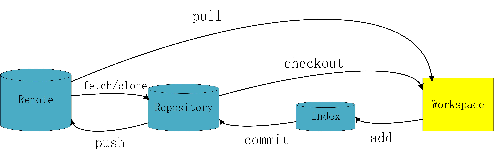

# 版本控制系统

## 为什么要有版本控制系统

在开发过程中，经常需要对一个文件进行修改甚至删除，但是我们又希望能够保存这个文件的历史记录，如果通过备份，那么管理起来会非常的复杂


## 什么是版本控制系统

> 版本控制系统（Version Control System）:是一种记录一个或若干文件内容变化，以便将来查阅特定版本修订情况的系统。

版本控制系统不仅可以应用于软件源代码的文本文件，而且可以对任何类型的文件进行版本控制。


## 版本控制系统的分类

参考文章：[关于版本控制的介绍](https://git-scm.com/book/zh/v1/%E8%B5%B7%E6%AD%A5-%E5%85%B3%E4%BA%8E%E7%89%88%E6%9C%AC%E6%8E%A7%E5%88%B6)

### 本地版本控制系统


本地版本控制系统就是在一台机器上，记录版本的不同变化，保证内容不会丢失

1. 如果多人开发，每个人都在不同的系统和电脑上开发，没办法协同工作。


### 集中式版本控制系統


`svn` 是集中式的版本控制系统，集中式版本控制系统都有一个单一的集中管理的服务器（中央服务器），保存所有文件的修订版本，而协同工作的人们都通过客户端连到这台服务器，取出最新的文件或者提交更新。

1. 需要一个中央服务器来管理代码的的版本和备份
2. 所有的用户电脑都是从中央服务器获取代码或者是将本地的代码提交到中央服务器
3. 依赖与网络环境，如果连不上中央服务器，就无法提交和获取代码。

### 分布式版本控制系统


`git` 是分布式的版本控制系统。分布式版本控制系统的客户端并不只提取最新版本的文件快照，而是把代码仓库完整地镜像下来。这么一来，任何一处协同工作用的服务器发生故障，事后都可以用任何一个镜像出来的本地仓库恢复。因为每一次的提取操作，实际上都是一次对代码仓库的完整备份

1. 需要一台服务器作为代码仓库
2. 每个用户电脑都是一个服务器（代码仓库），并且和代码仓库是镜像的，用户修改和获取代码都是提交到自己的服务器当中。
3. 不需要网络就可以进行工作。
4. 当连接网络时，用户可以选择将自己的服务器与代码仓库进行同步。


# Git

---


## Git 核心概念

* **`WorkSpace`**：
工作区，即从仓库中checkout出来的，需要通过Git进行版本控制的目录和文件，可以简单的理解为在电脑里真实看到的文件；

* **`Stage(Index)`**：
暂存区，或者叫做待提交更新区；在提交进入Repository之前，可以把所有的更新放在暂存区, 用 `git add` 的文件都在这里；

* **`Repository(Remote/Local)`**：
仓库，一个存放在远端／本地的版本库，用 `git commit` 提交的文件就到Local Repository,用 `git push` 提交的文件就到Remote Repository；

* **`.git`**：存放Git管理信息的目录，初始化仓库的时候会自动创建。

>

>


## Git 初始设置

### 设置用户名和邮箱

```bash
# 用户名使用英文
# --global 全局设置
git config --global user.name 'your_name'
git config --global user.email 'your_email@example.com'

# 查看账号信息
git config --list

# 重置信息
git config --unset -- user.name
```

全局设置会在` ~/.gitconfig`中以如下形式输出设置文件，可以直接编辑这个文件来修改设置

```bash
[user]
name = your_name
email = your_email@example.com
```

每个仓库的 Git 配置文件都放在 ` .git/config` 文件中，可以直接修改此文件
`$ cat .git/config` 查看配置文件


```bash
# 解决中文变成数字加百分号，也可以在设置中将编码修改为 utf-8
git config --global core.quotepath false
```


### 设置 SSH Key

GitHub 上连接已有仓库时的认证，是通过使用了 SSH 的公开密钥认证方式进行的。现在我们来创建公开密钥认证所需的 SSH Key，并将其添加至 GitHub

运行下面的命令

```bash
ssh-keygen -t rsa -C "your_email@example.com"
Generating public/private rsa key pair.
Enter file in which to save the key(/Users/your_user_directory/.ssh/id_rsa):按回车键
Enter passphrase (empty for no passphrase):输入密码
Enter same passphrase again:再次输入密码
```

输入密码后会出现以下结果

```bash
Your identification has been saved in /Users/your_user_directory/.ssh/id_rsa.
Your public key has been saved in /Users/your_user_directory/.ssh/id_rsa.pub.
The key fingerprint is:SHA256:hbn1zPihlVDe/Y2FvzzZU8l+AOSlVRlaOmro/nTQDGg cui3155@gmail.com(fingerprint值+your_email@example.com)
The key's randomart image is:
+---[RSA 2048]----+
|            o o++|
...
|        . . .   +|
|         ...     |
+----[SHA256]-----+
```

`id_rsa` 文件是私有密钥，`id_rsa.pub` 是公开密钥

### 添加公开密钥

在 GitHub 中添加公开密钥，今后就可以用私有密钥进行认证了
点击右上角的账户设定按钮（Account Settings），选择 SSH Keys 菜单。点击 AddSSH Key 之后，在 Title 中输入适当的密钥名称。Key 部分请粘贴 id_rsa.pub 文件里的内容

`id_rsa.pub` 的内容可以用如下方法查看

```bash
cat ~/.ssh/id_rsa.pub
ssh-rsa公开密钥的内容your_email@example.com
```

完成以上设置后，就可以用手中的私人密钥与 GitHub 进行认证和通信了

```bash
ssh -T git@github.com
The authenticity of host 'github.com (192.30.255.113)' can't be established.
RSA key fingerprint is (fingerprint值).
Are you sure you want to continue connecting (yes/no)?输入yes
Warning: Permanently added 'github.com,192.30.255.113' (RSA) to the list of known hosts.
Enter passphrase for key '/c/Users/C.DESKTOP-3S4APJ4/.ssh/id_rsa':
```

出现如下结果即为成功

```bash
Hi cuilongjin! You've successfully authenticated, but GitHub does not provide shell access.
```

### 提高命令输出的可读性
将 `color.ui` 设置为 `auto` 可以让命令的输出拥有更高的可读性

```bash
git config --global color.ui true
```

`~/.gitconfig` 中会增加下面一行

```bash
[color]
ui = true
```

这样一来，各种命令的输出就会变得更容易分辨。


### 文件名大小写问题

git 默认对文件名大小写不敏感

```bash
# 设置 git 大小写敏感
git config core.ignorecase false

# 或者先删除文件在添加进去
```


### 设置头像

通过 Gravatar 服务


### 配置别名

```bash
# 配置 st 别名表示 status
git config --global alias.st status

git config --global alias.co checkout
git config --global alias.ci commit
git config --global alias.br branch
git config --global alias.unstage 'reset HEAD'
git config --global alias.last 'log -1'

git config --global alias.lg "log --color --graph --pretty=format:'%Cred%h%Creset -%C(yellow)%d%Creset %s %Cgreen(%cr) %C(bold blue)<%an>%Creset' --abbrev-commit"
```


### 搭建 Git 服务器

[搭建Git服务器](https://www.liaoxuefeng.com/wiki/0013739516305929606dd18361248578c67b8067c8c017b000/00137583770360579bc4b458f044ce7afed3df579123eca000)


### 配置多用户

根据不同邮箱生成对应的私钥公钥

```bash
ssh-keygen -t rsa -C email
```

将公钥上传到对应的用户账号中

在 `.ssh` 目录创建 `config` 文件，配置私钥对应的服务器，每个账号单独配置一个 Host，每个 Host 要取一个别名，每个 Host 主要配置 HostName 和 IdentityFile 两个属性即可

```txt
# 配置用户1
Host github
HostName github.com
IdentityFile ~/.ssh/id_rsa_github
User cuilongjin

# 配置用户2
Host gitlab
HostName git.gitlab.net
IdentityFile ~/.ssh/id_rsa_gitlab
User cuilongjin
```

Host 的名字可以任意，不过这个会影响 git 相关命令，例如：

Host mygithub 这样定义的话，命令如下

`git clone git@mygithub:cuilongjin/cuilongjin.git`

即 git@ 后面紧跟的名字改为 mygithub

执行 `ssh -T git@github`、`ssh -T git@gitlab` 测试是否成功


配置局部 git 用户名和邮箱，如果没有局部配置，默认用全局配置

```bash
git config user.name "Your name"
git config user.email "your_email@gmail.com"
```

或者直接找到 `.git/config` 文件，添加

```bash
[user]
name = Your name
email = your_email@gmail.com
```


## Git 基本操作

### git init

```bash
mkdir project
cd project
git init
```

如果初始化成功，执行了 `git init` 命令的目录下就会生成 `.git`  目录。这个 `.git` 目录里存储着管理当前目录内容所需的仓库数据。
> `mkdir project` 命令创建 project 空文件夹
* `pwd` 命令用于显示当前目录

### git add

```bash
# 将指定文件夹添加到暂存区（目录中的所有文件，包括新增/修改/删除的文件）--not-all 忽略删除的
git add 目录名

# 将 指定文件 添加到暂存区 （文件可以是新增/修改/删除的）
git add README.md

# 将当前目录下所有的js文件添加到暂存区（文件可以是新增/修改的，不包括删除的）
git add *.js

# 添加当前目录及子目录下件 （文件可以是新增/修改/删除的）
git add .

# 添加当前仓库下所有的文件 （文件可以是新增/修改/删除的）
git add -A
git add --all
```

### git commit

```bash
# 将文件从暂存区提交到仓库
git commit -m '提交说明'

# 如果是一个已经暂存过的文件，可以快速提交，如果是未追踪的文件，那么命令将不生效。
git commit -a -m '提交说明'

# 修改最近的一次提交说明， 如果提交说明不小心输错了，可以使用这个命令
git commit --amend -m '提交说明'
```

-m 参数后的 `'First commit'` 称作提交信息，是对这个提交的概述,如果想要记述得更加详细，请不加 `-m` ，直接执行 `git commit` 命令，执行后编辑器就会启动。
在编辑器中记述提交信息的格式如下:
​	第一行：用一行文字简述提交的更改内容
​	第二行：空行
​	第三行以后：记述更改的原因和详细内容

### git status

```bash
# 建立 README.md 文件作为管理对象
touch README.md
git status

# 简化日志输出格式
git stauts -s (short)
```

`git status` 命令可以让我们时刻掌握仓库当前的状态，但不能看到具体修改了什么内容，需要用 `git diff` 这个命令来查看具体修改内容。

### git diff

```bash
# 查看当前工作树和最新add之间（暂存区）的差别（difference）
git diff
# 如果尚未用 `git add` 命令向暂存区添加任何东西，则程序只会显示工作树与最新提交状态之间的差别
# “+”号标出的是新添加的行，被删除的行则用“-”号标出

#查看README.md文件的修改
git diff -- README.md

# 查看工作树和最新提交的差别
git diff HEAD

# 查看暂存区与仓库区的不同
git diff --cached

# 查看两个版本之间的不同
git diff c265262 de4845b
```


>HEAD 是指向当前分支中最新一次提交的指针

### git log

```bash
# 显示当前版本之前的提交信息
git log
commit 9f129bae19b2c82fb4e98cde5890e52a6c546922
Author: cuilongjin <cuilongjin@gmail.com>
Date:   Sun Oct 8 22:08:39 2017 +0900
    First commit

# 只显示提交信息的第一行
git log --pretty=oneline # 完整显示版本号
git log --oneline  # 只显示前7位版本号

# 显示指定目录、文件的日志
git log 目录名或文件名

# 显示文件的改动（q键退出命令）
git log -p 文件名

# 显示所有曾经提交的版本（包括被删除的）
git reflog
```

### git reset

```bash
git reset -h		'查看帮助'
--mixed				'reset HEAD and index'(默认)
--soft				'reset only HEAD'
--hard  			'reset HEAD, index and working tree'
--merge 			'reset HEAD, index and working tree'
--keep 				'reset HEAD but keep local changes'
```

>1. `HEAD` 表示当前版本，上一个版本就是 `HEAD^` ，上上一个版本就是 `HEAD^^` ，当然往上100个版本写100个^比较容易数不过来，所以写成 `HEAD~100` 。
>2. 使用 `commit_id` 回退 , `git reflog` 用来记录你的每一次命令和 `commit_id`
```bash
git reset --soft HEAD^
git reset --hard commit_id
git reset HEAD [file]
```

### git checkout --file

```bash
git checkout -- README.md
```

把 README.md 文件在 `工作区的修改全部撤销` ，**用版本库里的版本替换工作区的版本**

这里有两种情况：

1. 一种是 README.md 自修改后还没有被放到暂存区，现在，撤销修改就回到和版本库一模一样的状态

2. 一种是 README.md 已经添加到暂存区后，又作了修改，现在撤销修改就回到添加到暂存区后的状态

总之，就是让这个文件回到最近一次git commit或git add时的状态，可用于**撤销文件修改或恢复误删文件**

### git remote

```bash
git remote add origin git@github.com:cuilongjin/git_test.git
```

添加后，远程库的名字就是origin，这是Git默认的叫法，也可以改成别的，但是origin这个名字一看就知道是远程库

```bash
# 查看远程库的信息
git remote -v
origin  git@github.com:cuilongjin/git_test.git (fetch)
origin  git@github.com:cuilongjin/git_test.git (push)
```

上面显示了可以抓取和推送的origin的地址。如果没有推送权限，就看不到push的地址

```bash
# 删除已有的GitHub远程库
git remote rm origin
```


### git pull

```bash
# 获取远程仓库的更新，并且与本地的分支进行合并
git pull

# 合并 pull 两个不同的项目出现 fatal: refusing to merge unrelated histories
git pull origin master ----allow-unrelated-histories
```


### git push

```bash
git push -u origin master
# 以强制覆盖的方式推送修改后的 repo （重新上传 repo）（不指定分支即所有分支）
git push origin --force --all
```

第一次推送分支时，加上 -u 参数，Git 会把本地分支和远程分支关联起来，在以后的推送或者拉取时就可以简化命令

>remote: error: GH007: Your push would publish a private email address.
解决方法——http://github.com/settings/emails 把Keep my email address private这一项去掉勾选即可。

如果推送失败，则因为远程分支比你的本地更新，需要先用 `git pull` 拉取远程的新提交

### git clone

```bash
git clone git@github.com:cuilongjin/仓库名.git [指定文件夹]
```

Git 支持多种协议，包括 https，但通过 ssh 支持的原生 git 协议速度最快

从远程库 clone 时，默认情况下，只能看到本地的 master 分支
要在 dev 分支上开发，就必须创建远程 origin 的 dev 分支到本地，于是用这个命令创建本地 dev 分支

```bash
git checkout -b dev origin/dev

# 指定本地 dev 分支与远程 origin/dev 分支的链接
git branch --set-upstream dev origin/dev
```


### git 忽视文件

在仓库中，有些文件是不想被 git 管理的，比如数据的配置密码、写代码的一些思路等。git 可以通过配置从而达到忽视掉一些文件，这样这些文件就可以不用提交了

忽略文件的原则是：

- 忽略操作系统自动生成的文件，比如缩略图等
- 忽略编译生成的中间文件、可执行文件等，也就是如果一个文件是通过另一个文件自动生成的，那自动生成的文件就没必要放进版本库，比如 Java 编译产生的 .class 文件
- 忽略你自己的带有敏感信息的配置文件，比如存放口令的配置文件


在仓库的根目录创建一个`.gitignore`的文件，文件名是固定的

将不需要被 git 管理的文件路径添加到`.gitignore`中，把 `.gitignore` 也提交到 Git，Git 就会自动忽略这些文件

```txt
# 忽视 index.txt 文件
index.txt

# 忽视 .gitignore 文件
.gitignore

# 忽视 css 下的 index.css 文件
css/index.css

# 忽视 css 下的所有的 css 文件
css/*.css

# 忽视 css 下的所有文件
css/*.*

# 忽视 css 文件夹
css
```

GitHub 已经为我们准备了各种配置文件 [https://github.com/github/gitignore](https://github.com/github/gitignore)


强制添加被 .gitignore 忽略的文件

```bash
# 强制添加被.gitignore忽略的文件
git add -f <file>

# 检查哪个规则忽略了此文件，以便修订规则
git check-ignore -v <file>
.gitignore:x:xxx.xx    xxxxxx
```


### git branch

在 git 中，分支实质上仅仅是一个指针，每次代码提交后，这个分支指针就会向后移动，保证一直指向最后一次提交的的版本。git 中使用 HEAD 指向当前分支

```bash
git branch
* master
```

`*`（星号）表示当前所在的分支

-a 参数可以查看远程分支(远程分支会用红色表示出来)

* git checkout -b 创建、切换分支

```bash
# 以 branch 为基础创建名为 feature-A 的分支
git checkout -b feature-A <branch>
```


连续执行下面两条命令也能收到同样效果

```bash
# 创建 feature-A 分支
git branch feature-A

# 将当前分支切换为 feature-A 分支
git checkout feature-A

# 切换回上一个分支
git checkout -
```

* git merge 合并分支

首先切换到 master 分支，然后执行

```bash
git merge [--squash] [--no-ff] -m "描述" feature-A
--squash # 只是将<branch>中的修改内容迁移过来，而不保留其中的commit历史
--no-ff # 创建合并提交，为了在历史记录中明确记录下本次分支合并
```

* git branch -d 删除分支

```bash
# 删除本地 feature-A 分支
git branch -d feature-A

# 强行删除本地 feature-A 分支
git branch -D feature-A

# 删除远程 feature-A 分支
git push origin :feature-A
或 git push origin --delete feature-A
```

* git branch -m 重命名分支

```bash
# 重命名本地分支
git branch -m old_branch new_branch

# 重命名远程分支
# 重命名本地分支 -> 删除远程分支 -> 推送到远程分支
```


### git stash

```bash
# 把当前工作现场“储藏”起来
git stash

# 查看存储的工作现场
git stash list
```

恢复工作现场

```bash
# 恢复工作现场，stash 内容并不删除
git stash apply

# 删除 stash 内容
git stash drop

# 恢复的同时把 stash 内容也删了
git stash pop
```

恢复指定的 stash，用命令：`git stash apply stash@{0}`

[廖雪峰Git教程创建与合并分支](https://www.liaoxuefeng.com/wiki/0013739516305929606dd18361248578c67b8067c8c017b000/001375840038939c291467cc7c747b1810aab2fb8863508000)

[廖雪峰Git教程分支管理策略](https://www.liaoxuefeng.com/wiki/0013739516305929606dd18361248578c67b8067c8c017b000/0013758410364457b9e3d821f4244beb0fd69c61a185ae0000)

[廖雪峰Git教程Bug分支](https://www.liaoxuefeng.com/wiki/0013739516305929606dd18361248578c67b8067c8c017b000/00137602359178794d966923e5c4134bc8bf98dfb03aea3000)


## Git 标签管理

### 创建标签

```bash
# 首先切换到需要打标签的分支上
# 默认标签是打在最新提交的 commit 上的
git tag v1.0

# 对指定某一次提交打标签
git tag v1.0 <commit id>

# 创建带有说明的标签，用 -a 指定标签名，-m 指定说明文字
git tag -a v1.0 -m "version1.0 released" <commit id>

# 通过 -s 用私钥签名一个标签(需配置gpg密钥对)
git tag -s v1.0 -m "signed version1.0 released" <commit id>
```

### 查看标签

```bash
# 查看所有标签
git tag
v1.0

# 查看所有标签信息
git show

# 查看 v1.0 标签信息
git show v1.0
commit id:xxx
Author:xxx
Date:xxx
```

### 推送标签到远程

```bash
# 推送 v1.0 标签到远程
git push origin v1.0

# 推送全部尚未推送的本地标签到远程
git push origin --tags
```

### 删除标签

```bash
# 删除本地标签 v1.0
git tag -d v1.0
# 删除远程标签 v1.0
git push origin :refs/tags/v1.0
或 git push origin --delete tag v1.0
```


## git 修改提交历史

修改最后一条commit

```bash
git commit --amend
```

修改多条commit

```
git rebase -i HEAD~3 修改最近三次提交
git rebase -i --root 修改所有提交
```

Commands

**p**, pick = use commit: 直接使用commit 不做任何修改，其中p 是pick的缩写，以下雷同；

**r**, reword = use commit, but edit the commit message: 使用commit，但是会更改commit 信息；

**e**, edit = use commit, but stop for amending :使用commit，但是遇到此命令时会停止合并；

**s**, squash = use commit, but meld into previous commit: 使用commit,但是会合并到前一个commit中；

**f**, fixup = like "squash", but discard this commit's log message：和squash类似，但是会抛弃commit的log信息

**x**, exec = run command (the rest of the line) using shell：使用shell运行命令

**d**, drop = remove commit：丢弃commit


<https://www.jianshu.com/p/67f20d19605a>


## other

* git add .` 的时候遇到 `warning: LF will be replaced by CRLF in ......`

```bash
git config core.autocrlf
git config --global core.autocrlf false

# true：添加文件到git仓库时，git将其视为文本文件。他将把crlf变成lf
# false：line-endings将不做转换操作。文本文件保持原来的样子
# input：把crlf转成lf，当有人Check代码时还是lf方式。因此在window操作系统下，不要使用这个设置

# CRLF (carriagereturnlinefeed)：表示句尾使用回车换行两个字符(即Windows编程时使用"\r\n"换行)
# LF(line feed)：表示句尾只使用换行(Unix Style)
# CR：表示只使用回车
```


* Git 永久删除文件(包括历史记录)

https://help.github.com/articles/removing-sensitive-data-from-a-repository/

```bash
# 在仓库的根目录执行
git filter-branch --force --index-filter 'git rm --cached --ignore-unmatch 文件路径' --prune-empty --tag-name-filter cat -- --all
# 文件路径相对于git仓库根目录
# 删除文件夹 添加 -r 命令

# 以强制覆盖的方式推送修改后的 repo （不指定分支即所有分支）（重新上传 repo）
git push origin --force --all

# 强制推送 tags
git push origin --force --tags

# 清理和回收空间
rm -rf .git/refs/original/
git reflog expire --expire=now --all
git gc --prune=now
git gc --aggressive --prune=now
```

重新[绑定](https://git-scm.com/book/en/Git-Branching-Rebasing)，而不是合并创建的旧（受污染）存储库历史记录中的任何分支


* git 修改已提交的某一次的邮箱和用户信息

```bash
git filter-branch -f --env-filter \
"GIT_AUTHOR_NAME='Newname'; GIT_AUTHOR_EMAIL='newemail'; \
GIT_COMMITTER_NAME='committed-name'; GIT_COMMITTER_EMAIL='committed-email';" HEAD
```


### fork 的项目 A 与原项目 B 保持同步

1. 将 A 克隆到本地做中转
2. 将 B 的 master 分支拉取到本地

```bash
git fetch <B 远程仓库地址> master:updated

# 或添加 B 远程仓库地址并拉取
git remote add update <B 远程仓库地址>
git fetch update master:updated
```

3. 合并并解决冲突

4. 推送